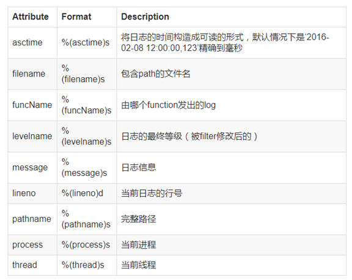
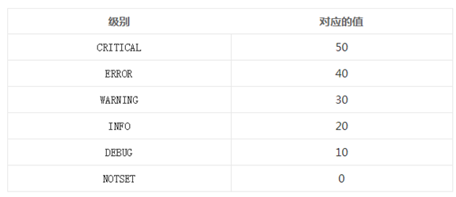
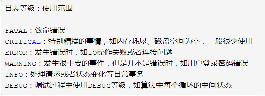

# Python日志

Python中的日志模块是logging，这个模块是内置的，不需要进行安装。

Python的logging模块提供了标志的日志接口，可以通过这个模块存储各种各样的日志，可以设置日志的等级、日志的保存位置、日志文件回滚。

在项目中为什么不使用print进行输出，而要使用日志

print对于简单程序有用，但是复杂的系统，不好用。首先，print出来的都是没用的输出，大量使用会被遗忘在代码中，print输出到控制台后，会影响在控制台查看其他数据。

使用logging的优势：

1.你可以控制消息的级别，过滤掉那些并不重要的消息。

2.你可决定输出到什么地方，以及怎么输出。有许多的重要性别级可供选择，debug、info、warning、error 以及 critical。通过赋予 logger 或者 handler 不同的级别，你就可以只输出错误消息到特定的记录文件中，或者在调试时只记录调试信息。

## logging的组成部分

**logging主要包括四个部分**

- Loggers:提供给程序直接调用的接口,app通过调用的api来记录日志，可以自己创建日志器。
- Handlers:日志的处理方式。可以进行不同日志的位置分配
- Filters:对日志信息进行过滤，提供更细粒的日志对是否进行日志输出进行判断
- Formatters:打印日志的格式

### Loggers

Loggers是 程序可以直接调用的一个接口，logger并不是直接实例化后使用的，而是需要通过方法

```python
logging.getLogger(name)
```

获取对象,logger是单例模式，logging是线程安全的,也就是说在项目中的任何位置打印日志所使用到的日志对象都是同一个。但是logger不支持多进程。

loggers是有父子关系的，当没有logger对象时，它的父类是root,当拥有父对象时，父子关系会被修正。

例如：logging.getLogger("abc.xyz") 会创建两个logger对象，一个是abc父对象，一个是xyz子对象，同时abc没有父对象，所以它的父对象是root。但是实际上abc是一个占位对象（虚的日志对象），可以没有handler来处理日志。但是root不是占位对象，如果某一个日志对象打日志时，它的父对象会同时收到日志，所以有些使用者发现创建了一个logger对象时会打两遍日志，就是因为他创建的logger打了一遍日志，同时root对象也打了一遍日志。

logger对象有三件事要做

- 向应用程序代码提供几个方法，使得应用程序可以在运行时记录日志信息
- 基于日志的等级或者日志的过滤来决定对那些日志需要进行后续处理
- 将日志信息发送给感兴趣的日志处理器

#### logger对象的方法

- logger.setLevel()：设置日志处理器将会处理日志的最低等级
- logger.addHandler 为logger添加处理器
- logger.removeHandler:为logger移除处理器
- logger.addFilter:为日志对象添加Filter对象
- logger.removeFilter:为日志对象移除Filter对象

#### 日志记录创建方式

- logger.debug
- logger.info
- logger.warning
- logger.error

#### 日志处理流程

- 创建一个logger,由logger产生日志
- logger设置日志等级
- 创建合适的handler
- 设置handler的日志等级
- 创建 日志的格式
- handler添加格式
- logger添加handler
- 打印日志

### Handlers

Handlers 将logger发过来的信息进行准确地分配，送往正确的地方。举个栗子，送往控制台或者文件或者both或者其他地方(进程管道之类的)。它决定了每个日志的行为，是之后需要配置的重点区域。

每个Handler同样有一个日志级别，一个logger可以拥有多个handler也就是说logger可以根据不同的日志级别将日志传递给不同的handler。当然也可以相同的级别传递给多个handlers这就根据需求来灵活的设置了。

logging模块中包含的handlers主要有

```
handler名称：位置；作用
 
StreamHandler：logging.StreamHandler；日志输出到流，可以是sys.stderr，sys.stdout或者文件
FileHandler：logging.FileHandler；日志输出到文件
BaseRotatingHandler：logging.handlers.BaseRotatingHandler；基本的日志回滚方式
RotatingHandler：logging.handlers.RotatingHandler；日志回滚方式，支持日志文件最大数量和日志文件回滚
TimeRotatingHandler：logging.handlers.TimeRotatingHandler；日志回滚方式，在一定时间区域内回滚日志文件
SocketHandler：logging.handlers.SocketHandler；远程输出日志到TCP/IP sockets
DatagramHandler：logging.handlers.DatagramHandler；远程输出日志到UDP sockets
SMTPHandler：logging.handlers.SMTPHandler；远程输出日志到邮件地址
SysLogHandler：logging.handlers.SysLogHandler；日志输出到syslog
NTEventLogHandler：logging.handlers.NTEventLogHandler；远程输出日志到Windows NT/2000/XP的事件日志
MemoryHandler：logging.handlers.MemoryHandler；日志输出到内存中的指定buffer
HTTPHandler：logging.handlers.HTTPHandler；通过"GET"或者"POST"远程输出到HTTP服务器
```


### Filters

Filters 提供了更细粒度的判断，来决定日志是否需要打印。原则上handler获得一个日志就必定会根据级别被统一处理，但是如果handler拥有一个Filter可以对日志进行额外的处理和判断。例如Filter能够对来自特定源的日志进行拦截or修改甚至修改其日志级别（修改后再进行级别判断）。

logger和handler都可以安装filter甚至可以安装多个filter串联起来。

### Formatters

Formatters 指定了最终某条记录打印的格式布局。Formatter会将传递来的信息拼接成一条具体的字符串，默认情况下Format只会将信息%(message)s直接打印出来。Format中有一些自带的LogRecord属性可以使用，如下表格:



一个Handler只能拥有一个Formatter 因此如果要实现多种格式的输出只能用多个Handler来实现。


### 日志级别

在记录日志时, 日志消息都会关联一个级别(“级别”本质上是一个非负整数)。系统默认提供了6个级别，它们分别是：



可以给日志对象(Logger Instance)设置日志级别，低于该级别的日志消息将会被忽略，也可以给Hanlder设置日志级别，对于低于该级别的日志消息, Handler也会忽略。



### 常用函数

### **logging.basicConfig([\**kwargs]):**

**为日志模块配置基本信息。**

**参数解析**

**filename** ：日志文件的保存路径。如果配置了些参数，将自动创建一个FileHandler作为Handler；
**filemode** ：日志文件的打开模式。 默认值为’a’，表示日志消息以追加的形式添加到日志文件中。如果设为’w’, 那么每次程序启动的时候都会创建一个新的日志文件；
**format** ：设置日志输出格式；
**datefmt** ：定义日期格式；
**level** ：设置日志的级别.对低于该级别的日志消息将被忽略；
**stream** ：设置特定的流用于初始化StreamHandler；

参数：作用

%(levelno)s：打印日志级别的数值
%(levelname)s：打印日志级别的名称
%(pathname)s：打印当前执行程序的路径，其实就是sys.argv[0]
%(filename)s：打印当前执行程序名
%(funcName)s：打印日志的当前函数
%(lineno)d：打印日志的当前行号
%(asctime)s：打印日志的时间
%(thread)d：打印线程ID
%(threadName)s：打印线程名称
%(process)d：打印进程ID
%(message)s：打印日志信息

### **logging.getLogger([name])**

**创建Logger对象**。日志记录的工作主要由Logger对象来完成。在调用getLogger时要提供Logger的名称（注：多次使用相同名称来调用getLogger，返回的是同一个对象的引用。），Logger实例之间有层次关系，这些关系通过Logger名称来体现，如：

p = logging.getLogger(“root”)

c1 = logging.getLogger(“root.c1”)

c2 = logging.getLogger(“root.c2”)

例子中，p是父logger, c1,c2分别是p的子logger。c1, c2将继承p的设置。如果省略了name参数, getLogger将返回日志对象层次关系中的根Logger。

### **logging.getLevelName(lvl)**

**获取日志级别对应的名称**。例如：

```python
import logging

print(logging.getLevelName(10))
print(logging.getLevelName(logging.DEBUG))

print(logging.getLevelName(40))
print(logging.getLevelName(logging.ERROR))
```

### **logging.shutdown()**

当不再使用日志系统的时候，调用该方法，它会将日志flush到对应的目标域上。一般在系统退出的时候调用。

### **Logger.setLevel(lvl):**

设置日志的级别。对于低于该级别的日志消息将被忽略。

```python
logger = logging.getLogger('root.test')  
logger.setLevel(logging.INFO)  
console_handler = logging.StreamHandler()  
console_handler.setLevel(logging.WARNING)  
logger.addHandler(console_handler)  
 
logger.info('info') #不会记录  
logger.debug('debug') #不会记录  
logger.warning('warning') #记录warning  
logger.error('error')   #记录error  
```

### **Logger.debug(msg [ ,\*args [, \**kwargs]])**

记录DEBUG级别的日志信息。参数msg是信息的格式，args与kwargs分别是格式参数。

### **Logger.info(msg[ , \*args[ , \**kwargs] ] )**

### **Logger.warnning(msg[ , \*args[ , \**kwargs] ] )**

### **Logger.error(msg[ , \*args[ , \**kwargs] ] )**

### **Logger.critical(msg[ , \*args[ , \**kwargs] ] )**

记录相应级别的日志信息。参数的含义与Logger.debug一样。

### 增加移除处理器

### **Logger.addHandler(hdlr)**

### **Logger.removeHandler(hdlr)**

添加/移除日志消息处理器。在讲述Handler时具体介绍。

### **Logger.log(lvl, msg[ , \*args[ , \**kwargs] ] )**

记录日志，参数lvl用户设置日志信息的级别。参数msg, *args, **kwargs的含义与Logger.debug一样。

### **Logger.exception(msg[, \*args])**

以ERROR级别记录日志消息，异常跟踪信息将被自动添加到日志消息里。Logger.exception通过用在异常处理块中

```python
try:
     raise IOError, 'this is a winter testing IOError'
 except IOError:
     logger.exception('record this error')
     logger.warning(''.center(50,'-'))
```


### **Logger.addFilter(filt)**

### **Logger.removeFilter(filt)**

添加/移除日志消息过滤器。在讲述Filter时具体介绍。

### Logger.makeRecord(name, lvl, fn, lno, msg, args, exc_info[, func, extra])

创建LogRecord对象。日志消息被实例为一个LogRecord对象，并在日志类内处理。

默认情况下，logging将日志打印到屏幕，日志级别为WARNING；
日志级别大小关系为：CRITICAL > ERROR > WARNING > INFO > DEBUG > NOTSET，当然也可以自己定义日志级别。


### 打印日志到控制台

```python
"""
asctime:日志时间
name:当前文件的__name__属性值
levelname:日志名字
message:日志信息
filename:输出日志到指定的文件
filemode:文件模式。默认为a,可以进行修改w
"""
logging.basicConfig(level=logging.INFO, format='%(asctime)s-%(name)s-%(levelname)s-%(message)s', filename='a.txt')
logger = logging.getLogger(__name__)
logger.info('start print log')
logger.debug('do something')
logger.warning('something maybe fail')
logger.error('finsh')
```

### 设置消息的等级

```
日志等级：使用范围
FATAL：致命错误
CRITICAL：特别糟糕的事情，如内存耗尽、磁盘空间为空，一般很少使用
ERROR：发生错误时，如IO操作失败或者连接问题
WARNING：发生很重要的事件，但是并不是错误时，如用户登录密码错误
INFO：处理请求或者状态变化等日常事务
DEBUG：调试过程中使用DEBUG等级，如算法中每个循环的中间状态
```

### 日志回滚

```python
import logging
from logging.handlers import RotatingFileHandler

"""
Python中的日志回滚使用模块RotatingFileHandler
这个模块可以用来设置日志文件的大小和日志文件备份的数量
"""

# 创建一个logger对象
logger = logging.getLogger(__name__)
# 设置logger对象的级别
logger.setLevel(logging.DEBUG)

# 创建日志回滚对象
"""
RotatingFileHandler
"""
r_logger = RotatingFileHandler('log_.txt', maxBytes=2 * 1024, backupCount=3, encoding='utf-8')
r_logger.setLevel(logging.INFO)
# 设置格式
formatter = logging.Formatter('%(asctime)s -- %(levelname)s -- %(name)s -- %(message)s')
# 添加格式
r_logger.setFormatter(formatter)

# 打印到控制台的信息
console = logging.StreamHandler()
console.setLevel(logging.INFO)
console.setFormatter(formatter)

# 日志对象添加处理方式
logger.addHandler(r_logger)
logger.addHandler(console)

# 添加信息
logger.info('start')
logger.debug('do')
logger.warning('something')
logger.error('finish')
```

### 捕获异常

```python
import logging
from logging.handlers import RotatingFileHandler

"""
捕获异常是用try except的结构
"""

# 创建一个logger对象
logger = logging.getLogger(__name__)
logger.setLevel(logging.DEBUG)

# 创建一个日志回滚处理器
r_logger = RotatingFileHandler(filename='log2.txt', maxBytes=3 * 1024, backupCount=3, encoding='utf-8')
r_logger.setLevel(logging.INFO)
formatter = logging.Formatter('%(asctime)s -- %(levelname)s -- %(name)s -- %(message)s')
r_logger.setFormatter(formatter)

# 创建一个打印到控制台的处理器
console = logging.StreamHandler()
console.setLevel(logging.INFO)
console.setFormatter(formatter)

# 日志添加处理器
logger.addHandler(r_logger)
logger.addHandler(console)

# 输出信息
logger.info('start')
logger.debug('do')
logger.warning('something')

# 捕获异常
try:
    open('test.txt', 'r')
except (SystemExit, KeyboardInterrupt):
    raise
except Exception:
    # exc_info=True 输出异常信息 stack_info=True 输出对应的堆栈信息
    # logger.error('Faild to open test.txt from logger.error', exc_info=True)
    logger.exception('Faild to open test.txt from logger.exception', stack_info=True)
logger.info('finish')
```

### JSON格式配置日志

#### JSON文件

```json
{
  "version": 1,
  "disable_existing_loggers": false,
  "formatters": {
    "simple": {
      "format": "%(asctime)s -- %(levelname)s -- %(name)s -- %(message)s"
    },
    "verbose": {
      "format": "%(asctime)s -- %(levelname)s -- %(name)s -- %(thread)d -- %(process)d"
    }
  },
  "handlers": {
    "console": {
      "class": "logging.StreamHandler",
      "level": "INFO",
      "formatter": "simple"
    },
    "info_file_handler": {
      "class": "logging.handlers.RotatingFileHandler",
      "level": "INFO",
      "filename": "info.log",
      "maxBytes": 3072,
      "backupCount": 3,
      "encoding": "utf8",
      "formatter": "verbose"
    },
    "error_file_handler": {
      "class": "logging.handlers.RotatingFileHandler",
      "level": "ERROR",
      "filename": "error.log",
      "maxBytes": 3072,
      "backupCount": 3,
      "encoding": "utf8",
      "formatter": "verbose"
    }
  },
  "loggers": {
    "my_logger": {
      "level": "ERROR",
      "handlers": [
        "error_file_handler"
      ],
      "propagate": false
    }
  },
  "root": {
    "level": "DEBUG",
    "handlers": [
      "info_file_handler",
      "console"
    ]
  }
}
```

#### JSON格式配置日志

```python
import json
import logging.config

"""
可以通过json文件的格式来配置日志文件
"""

# 读取创建的json文件
with open('log1.json', 'r') as f:
    con = json.load(f)
logging.config.dictConfig(con)

logger = logging.getLogger('my_logger')
logger.info('start')
logger.error('finish')
```

### yaml格式配置日志

#### yaml文件

```yaml
version: 1
disable_existing_loggers: False
formatters:
  simple:
    format: "%(asctime)s -- %(levelname)s -- %(name)s -- %(message)s"
  verbose:
    format: "%(asctime)s -- %(levelname)s -- %(name)s -- %(message)s -- %(thread)d -- %(process)d"
handlers:
  console:
    class: logging.StreamHandler
    level: INFO
    formatter: simple
  info_file_handler:
    class: logging.handlers.RotatingFileHandler
    level: INFO
    formatter: verbose
    maxBytes: 3072
    filename: infoym.log
    backupCount: 3
    encoding: utf8
  error_file_handler:
    class: logging.handlers.RotatingFileHandler
    level: ERROR
    formatter: verbose
    maxBytes: 3072
    filename: errory.log
    backupCount: 3
    encoding: utf8
loggers:
  mylogger:
    level: INFO
    handlers: [ info_file_handler, console ]
    propagate: True
root:
  levle: INFO
  handlers: [ info_file_handler, console,error_file_handler ]
```

使用yaml进行读取文件之前，需要安装相应的模块

```python
pip install pyyaml
```

```python
import yaml
import logging.config

"""
使用yaml配置日志
"""

with open('log.yaml', 'r', encoding='utf-8') as f:
    config = yaml.load(f)
logging.config.dictConfig(config)

logger = logging.getLogger('mylogger')
logger.info('start')
```