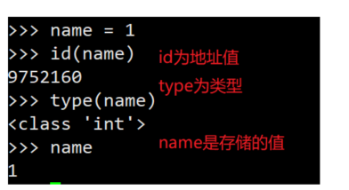
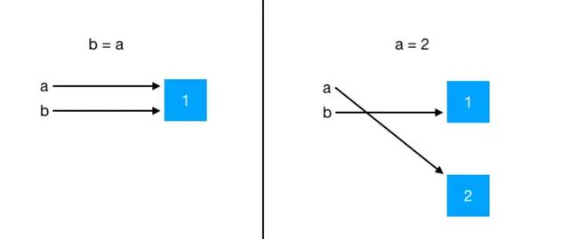
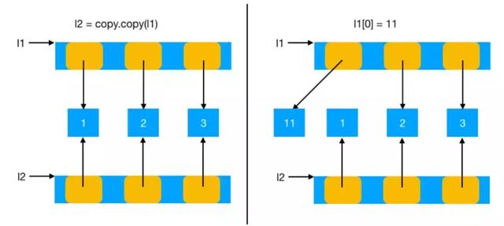

# Python深拷贝和浅拷贝

**数据的拷贝会设计到三个概念：分别是对象，可变类型和引用**

## Python对象

Python中皆是对象，所有的Python对象都会有三个属性:地址值、类型、值



## 可变对象与不可变对象

**这里的可变与不可变是值的改变和不改变**。

对于不可变类型，如果要更改，则会在内存中重新开辟一个空间用来存储新对象。对于可变类型，只是将对应的值改变，然后将引用指向新的值，地址是没有发生改变的。

在Python中，按照更新值的方式，可以将对象发为两大类：可变对象和不可变对象

可变对象：可变对象指的是可变对象的值是可变的，地址值是不会改变的

**Python中的可变对象有：列表，字典，集合**

不可变对象：不可变对象指的是对象的值和地址值都是不可变的。新创建的对象被关联到原来的变量名，会覆盖原来的变量名，原来的对象名就会被丢弃，垃圾回收器会在适当的时机回收这些对象。

**Python中的不可变对象有:数字、字符串、元组、float**

## 引用

每个对象都会在内存中开辟一个空间用来保存该对象，该对象在内存中所处的位置称为引用。**定义的变量名实际上也就是对象地址的引用。引用就是内存中的一个数字地址编号**，在使用这个对象时，需要知道这个对象的地址，才可以操作这个对象。但是由于这个地址值不好记忆，所以使用变量的形式来代替数字地址，Python中，变量名就是地址的表现形式，不会进行开辟存储空间。就像IP地址和域名的关系，IP地址不便于记忆，使用域名来代替IP。

## 引用赋值

**赋值的本质就是让多个变量同时指向同一个对象的地址值**

### 不可变对象引用赋值

不可变对象赋值，实际上就是在内存中开辟一个新的内存，让变量指向新的对象，地址值会发生改变



### 可变对象的赋值

可变对象保存的不是真正的数据，而是对象的引用。当对可变对象进行修改时，只是将可变对象保存的引用指向了新的对象

在l1进行修改后，整个列表的引用都会指向一个新的对象，但是l1和l2都是指向保存的同一个列表中的引用，引用不会发生改变，

但是列表中的元素的地址值是会发生改变的



```python
l1 = [1, 2, 3, 4, 5]
l2 = l1
print(id(l2))
print(id(l1))

l1[0] = 5  # 改变l1中的元素
print(id(l2))
print(id(l1))

# 结果
2814366242504
2814366242504
2814366242504
2814366242504
```

## 浅拷贝

浅拷贝会创建出一个新的对象，内容是原对象的引用

浅拷贝有三种形式：切片操作，工厂函数，copy模块中copy函数

**浅拷贝之所以被称为浅拷贝,是因为浅拷贝只拷贝了外面的一层对象，内部的元素都只是拷贝了一个地址值，并没有拷贝元素**

**浅拷贝需要分为两种情况**

### 拷贝不可变对象

浅拷贝拷贝不可变对象时和赋值的情况一样，新的对象的地址值和原来对象的地址值相同。不会开辟新的内存空间来存储值，只是多个变量指向同一个对象,所以地址值是相同。

### 可变对象

**如果不对可变对象进行修改操作，那么不会影响到浅拷贝的值** 原来值的地址值和拷贝后的地址值不相同,因为浅拷贝会在内存中开辟一块新的内存空间来存储拷贝后的对象.  如果可变对象中不包含其他可变对象，那么修改可变对象后不会影响到拷贝后的对象，修改拷贝后的对象也不会影响到原来的对象，如果可变对象中包含其他可变对象，那么修改拷贝后对象也会影响原来的对象，修改原来的对象也会影响拷贝后的对象。

```python
import copy

a = [1, 2, 3]
b = [5, 6, 7, a]
c = copy.copy(b)
print(id(b))
print(id(c))

print(b)
print(c)

# 执行结果
2428405832200
2428405996552
[5, 6, 7, [1, 2, 3]]
[5, 6, 7, [1, 2, 3]]
```

如果对可变对象进行修改操作，那么会影响到浅拷贝的值,因为浅拷贝拷贝的是最外层的引用，并没有拷贝内部元素的引用，也就是浅拷贝后的对象内部元素的引用是相同的，内部元素对应着同一个地址值，外围的地址值会发生改变，所以对浅拷贝中的可变对象进行修改时，值都会发生变化。**简单的说，浅拷贝只会拷贝父对象，不会拷贝内部的子对象。**

## 深拷贝

深拷贝会拷贝父对象和子对象，以及它们的地址值。通过深拷贝后的对象和原来的对象没有关系，原来的对象修改不会影响深拷贝后的结果，深拷贝后修改不会影响原来的值

拷贝不可变对象,也就是对对象进行赋值,不会开辟新空间来存储值，指向的都是同一个值

拷贝可变对象时，会逐层进行拷贝,直到所有的引用都是不可变对象为止

## 函数值传递

**Python中函数在进行传值时，实际上把将形参中传入的对象的引用依次赋值给函数内部变量。**

```python
def func_int(a):
    a+=4
 
def func_list(l1):
    l1[0]=4
 
t=0
func_int(t)
print(t)    # 0
 
t_list=[1,2,3]
func_list(t_list)
print(t_list)   # [4, 2, 3]
```

func_int为不可变对象。func_list为可变对象

func_int中的a其实是全局变量t所指向的一个引用，由于整数是不可变的，对局部变量a进行修改时，实际上是将t的引用赋值给了a,也就是a指向t的值0.func_list在进行传值时，实际上l1和t_list指向的是同一个地址值，也就是同一个对象。

## 总结

1. 不可变对象在进行赋值时会开辟内存空间
2. 可变对象在进行赋值时。修改一个的值，另一个的值也会发生改变
3. 深拷贝，浅拷贝在对不可变对象进行拷贝时，不会开辟空间，相当于赋值操作
4. 浅拷贝在进行拷贝时，只会拷贝第一层的引用，不会拷贝内部子元素的引用。如果内部子元素是可变对象，并且对内部可变子元素进行了修改了，那么浅拷贝后的值也会发生改变
5. 深拷贝在进行拷贝，会进行逐层拷贝，直到所有的引用都是不可变的对象为止
6. Python中有多种方式实现浅拷贝，copy模块中的copy函数，对象的copy函数，工厂方法，切片
7. 大多数情况，都是使用的浅拷贝
8. 浅拷贝的优点：速度快，占用空间少，效率高

python中默认使用浅拷贝的原因

1. 时间角度：浅拷贝花费时间更少
2. 空间角度：浅拷贝占用的内存更少
3. 效率角度：浅拷贝只拷贝顶层的数据，一般情况下比深拷贝的效率高