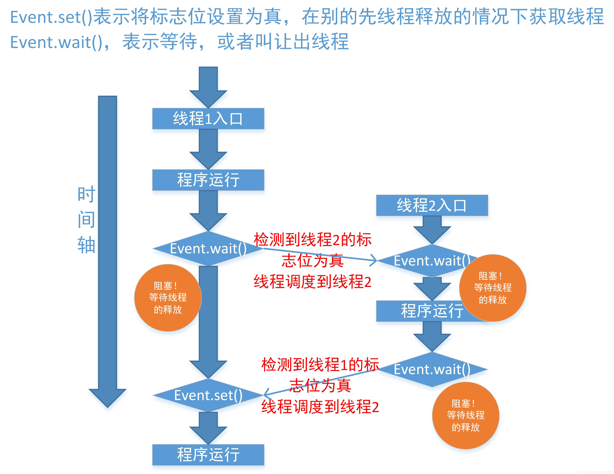
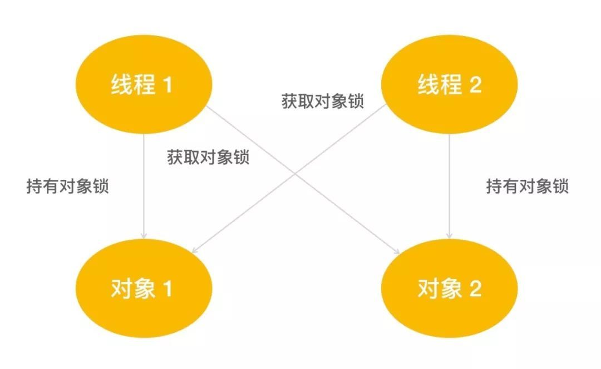

# Python线程和进程

## 并发和并行

python多线程属于并发，python多进程属于并行

**并行：同一时刻有多个任务可以执行** 多个处理器执行多个任务

**并发：同一个时刻只有一个任务可以执行 ** 一个处理器执行多个任务 交替执行

## 线程

## 线程常用方法

```
创建线程
thread = threading.Thread()
thread:自定义的线程实例名
threading.current_thread() 线程对象
threading.current_thread().getName():获得线程名字
thread.setName():设置线程名
threading.current_thread().is_alive:判断线程是否活动
join:阻塞线程  规定当前线程可以占用CPU的时间，默认是从线程的创建到死亡
sleep:休眠线程
threading.enumerate():以列表的形式返回正在活动的线程
threading.activeCount():返回正在活动的线程，结果和enumerate一样
start:启动线程 新建状态--->就绪状态
run:主线程运行对应的目标函数以及参数
setDaemon(True) 守护线程  主线程结束子线程也结束
thread.daemon=True 守护线程
```

所有的操作系统都支持同时运行多个任务，每个任务通常是一个程序，每一个运行的程序就是一个进程。进程是应用程序的执行实例。现在的操作几乎都支持多进程并发执行。

**线程是程序执行的最小单位，进程是操作系统资源分配的最小单位。**

线程是进程的组成部分，一个进程可以包含多个线程。在多线程中，会有一个主线程来完成整个进程从开始到结束的全部操作，其他的线程会在主线程运行过程中被创建或退出。当进程被初始化了，主线程也就被创建了，对于绝大多数的应用程序来说，通常仅要求有一个主线程，但也可以在进程中创建多个顺序执行流，这些执行流就是线程。

每个线程都会有自己的父进程，并且可以拥有自己的堆栈、程序计算器和局部变量，但是不拥有系统资源，因为父进程和其他线程共享该进程中拥有的所有的系统资源。线程可以完成一部分任务，可以与其他线程共享父进程中拥有的共享变量及部分环境，相互协同完成进程索所要完成的任务。

**多个线程共享父进程中所有资源，线程不会影响同一进程中的其他线程**

线程之间是独立运行的，同一个进程中的线程并不知道进程是否还有其他线程，线程的运行是抢占式的，也就是说，当前运行的线程在任何时候都有可能会被挂起，以便于其他线程的运行。

多线程是并发执行，但是在python中，同一时刻只允许一个线程运行，这和GIL(全局解释器)锁有关。

一个线程可以创建或者撤销一个线程，同一个进程中的线程可以并发运行。

**线程和进程的关系：操作系统可以同时执行多个任务，每一个任务就是一个进程，进程可以同时执行多个任务，每一个任务就是一个线程。**

## **Python中创建线程的方式**

**Python3中创建线程的方式有两种**

1. 直接使用threading模块中的Thread类来进行线程的创建。即对类threading.Thread进行实例化创建线程，并调用实例对象的start方法启动线程。
2. 继承threading模块中的Thread类来创建线程类。即用thread.Thread派生出一个新的子类，将新建类实例化创建线程，并调用实例化对象的start方法启动线程。

Thread类提供的方法

```
__init__(self, group=None, target=None, name=None, args=(), kwargs=None, *,daemon=None)
参数解析：
	group:指定创建的线程属于那个线程组，该参数尚未实现，无需调用
	target:指定线程调用的任务
	name:线程的名字
	args:以元组的方式，为target指定方法传递参数
	kwargs:以字典的方式，为target指定方法传递参数
	daemon:守护线程，主线程结束后，所有子线程也要结束
```

## 线程的生命周期


线程从创建到消亡的过程会经历5个状态，分别是:新建、就绪、运行、阻塞、死亡

新建：当线程被创建，在未调用start方法之前，线程都是处于新建状态。当新建状态的线程调用了start方法，线程状态就从新建状态进入就绪状态。

就绪：告诉CPU，线程可以进行执行了，但是具体什么时候执行，取决于CPU什么时候调度。如果一个线程进入了就绪状态，只能说明该线程做好了被CPU调度的准备，并不是调用了start方法就会立即被执行。start方法只能被新建状态的线程进行调用，**这就意味着每个线程只会调用一次start方法，如果多次调用start方法，python解释器会抛出RuntimError异常**

**注意：线程从新建状态进入就绪状态，只有一个办法，就是调用start方法。**

**直接调用Thread类中调用构造方法指定的函数，或者直接调用Thread子类中的run实例方法，无法从新建状态转到就绪状态。**这两种方法都可以进行执行目标代码，但是是由主线程MainThread负责执行，不是由新创建的子线程进行执行。原因很简单：一方面Python解释器会将它们看成是普通的函数调用和类方法调用。另一方面，由于新建的线程属于新建状态不属于就绪状态，得不到CPU的调度。

当就绪状态的线程得到了CPU调度，就会进行执行目标target对应的目标函数及参数或者run方法。但是如果有多个线程处于就绪状态，处于运行状态的线程就一直霸占CPU，为了使其他线程有执行的机会，CPU会在一定时间内强制当前运行的线程让出CPU资源，供其他线程使用。而对于获得CPU调度但没有执行完毕的线程，会进入阻塞状态。

```
目前几乎所有的桌面和服务器操作系统，都采用的是抢占式优先级调度策略。即 CPU 会给每一个就绪线程一段固定时间来处理任务，当该时间用完后，系统就会阻止该线程继续使用 CPU 资源，让其他线程获得执行的机会。而对于具体选择那个线程上 CPU，不同的平台采用不同的算法，比如先进先出算法（FIFO）、时间片轮转算法、优先级算法等，每种算法各有优缺点，适用于不同的场景。
```

**以下几种情况也会让线程从运行状态转为阻塞状态**

```
1. 线程调用了 sleep() 方法；
2. 线程等待接收用户输入的数据；
3. 线程试图获取某个对象的同步锁时，如果该锁被其他线程所持有，则当前线程进入阻塞状态；
4. 线程调用 wait() 方法，等待特定条件的满足；
```

以上几种情况会让线程从运行状态转为阻塞状态，只有解决了线程的问题时，线程才会从阻塞状态进入就绪状态，继续等待CPU的调度。以上四种情况的解决措施为：

```
1. sleep() 方法规定的时间已过；
2. 线程接收到了用户输入的数据；
3. 其他线程释放了该同步锁，并由该线程获得；
4. 调用 set() 方法发出通知；
```

对于获得CPU调度但未完全执行完毕的线程，它会转入阻塞状态，待条件成熟后继续转入就绪状态，重复抢占CPU资源，直到其执行结束，执行结束的线程处于死亡状态。

**注意：**

1. **线程执行结束，除了正常执行结束外，如果程序执行过程发生异常或者错误，线程也会进入死亡状态**
2. **主线程死亡，并不是意味着所有线程也会死亡。主线程的死亡，不会影响其他子线程的执行。**
3. **对于死亡的线程，无法再调用start方法使其重新启动，否则Python解释器会抛出RuntimeError异常。**

## join()方法

join的作用是在程序指定位置，优先让该方法的调用者使用CPU资源

```
join([timeout])  timeout为超时时间，可选
```

join的功能是让指定的线程可以占用多久的CPU资源，单位是秒，如果不给timeout，则默认是线程执行结束进入到死亡状态才释放CPU资源。

## 守护线程

守护线程的作用是当程序中主线程及所有非守护线程执行结束时，未执行完毕的守护线程也会随之消亡（进行死亡状态），程序将结束运行。

```python
thread.setDaemon(True)
or
thread.daemon=True
```

注意：线程设置守护对象必须要在就绪状态之前，即在start方法之前。否则，python解释器会抛出RuntimeError错误

## 线程睡眠

线程睡眠使用sleep函数，可以让线程进行睡眠，也就是让线程暂停执行，即当前线程进入阻塞状态，当到达时间后，由阻塞状态变为就绪状态，继续等待CPU调度。

```python
import time
time.sleep(se)
```

## 线程局部变量Local

多个线程在访问公共变量时，如果涉及到资源的操作，为了保证数据的准确性，需要使用互斥锁机制。

多线程中还提供了一种方式，就是local函数,用来解决数据不同步的问题。

使用local函数创建的变量，会被各个线程进行调用。但是和公共资源不同，**各个线程在使用local函数创建的变量时，都会在自己的内存中拷贝一份。**这也就意味着，local创建的变量看似是全局变量，可以被各个线程进行调用，其实**线程调用的都是副本，线程之间各调各的，之间并无关系。**

也就是，local可以为各个线程创建属于它们自己的变量，也就是局部变量。从而使得各个线程操作的是属于自己的变量，该资源属于各个线程的私有资源。因此可以从根本上解决数据安全问题。

```python
import threading
import time
# 创建一个全局变量local  各个线程都可以进行访问
local = threading.local()
def work():
    local.x = 0 # 在全局变量中定义一个属性X,子线程进行访问时，会将该属性进行一个备份,运行该属性的副本
    for i in range(100):
        time.sleep(0.0001)
        local.x += 1
    print(threading.current_thread().getName(), local.x)


for i in range(5):
    thread = threading.Thread(target=work)
    thread.start()
    thread.join()
```

```python
"""
线程私有变量local
多个线程访问全局变量，如果涉及到对全局变量的修改，操作，那么就会出现数据不同步的问题，
可以使用互斥锁来进行解决，也可以使用local【线程私有变量】
"""
import threading

import time

# 创建一个全局变量local  各个线程都可以进行访问
local = threading.local()


def process_thread(res):
    # print('--->', res)  # t1, t2
    # local.resource=t1 or local.resource=t2
    local.resource = res  # 在全局变量中定义一个变量resource 即为线程的局部变量 会将全局变量中属性进行拷贝到自己的存储空间
    process()  # 拷贝完成后，开始执行后面的函数


def process():
    # 获取当前线程关联的资源
    rep = local.resource  # 虽然名字相同，但是存储的是不同的线程
    print(local.resource)
    print('***>', rep)
    rep = rep + '111'
    print(rep)


# 定义2个线程
t1 = threading.Thread(target=process_thread, args=('t1',))
t2 = threading.Thread(target=process_thread, args=('t2',))
t1.start()
t2.start()
```

## 定时器Timer

Thread中有一个子类Timer，该子类可以用于控制指定函数在特定时间运行一次

Timer只能控制函数在指定的时间内运行一次，如果要使用Timer函数多次执行，则需要再次进行调度

取消Timer的调度，可以使用Timer对象的cancel函数

```python
import time
from threading import Timer


def hello():
    print('Hello Word')


t = Timer(8, hello)
t.start()

count = 0


def hello1():
    print(time.time())
    global t, count
    count += 1
    if count < 10:
        t = Timer(1, hello1)
        t.cancel()  # 取消调度
        t.start()


t = Timer(1, hello1)
t.start()
```

## schedule任务调度

使用Timer计时器有一个弊端，即只能控制线程在指定的时间内执行一次任务。如果需要多次进行调度任务

Python中还有一个非常强大的模块sched，该模块中有一个schedule类，可以用来执行更加复杂的任务

**schedule的构造方法**

```python
schedule(timefunc=time.monotonic, delayfunc=time.sleep)
```

可以向该构造方法中传入 2 个参数（当然也可以不提供，因为都有默认值），分别表示的含义如下：

- timefunc：指定生成时间戳的函数，默认使用 time.monotonic 来生成时间戳；
- delayfunc：在未到达指定时间前，通过该参数可以指定阻塞任务执行的函数，默认采用 time.sleep() 函数来阻塞程序。

**schedule的其他方法**

| **scheduler.enter(delay, priority, action, argument=(), kwargs={})** | **在 time 规定的时间后，执行 action 参数指定的函数，其中 argument 和 kwargs 负责为 action 指定的函数传参，priority 参数执行要执行任务的等级，当同一时间点有多个任务需要执行时，等级越高（ priority 值越小）的任务会优先执行。该函数会返回一个 event，可用来取消该任务。** |
| ------------------------------------------------------------ | ------------------------------------------------------------ |
| **scheduler.cancel(event)**                                  | **取消 event 任务。注意，如果 event 参数执行的任务不存在，则会引发 ValueError 错误。** |
| **scheduler.run(blocking=True)**                             | **运行所有需要调度的任务。如果调用该方法的 blocking 参数为 True，该方法将会阻塞线程，直到所有被调度的任务都执行完成。** |

```python
# @Author:hu
# @Time:2021/9/1 13:40 
# @File:schedule类.py
# @Software: PyCharm
"""
schedule类可以用来执行更加复杂的任务调度
"""
import threading
from sched import scheduler


def action(arg):
    """
    要运行的函数
    :param arg:
    :return:
    """
    print(arg)


def thread_action(*add):
    """
    线程需要运行的函数
    :param add: *add可以接收多个非关键字形式的参数,使用*进行解包
    :return:
    """
    # 创建任务调度对象，并进行接收
    sche = scheduler()

    # 定义优先级  优先级越大，数字越小
    i = 3
    for a in add:
        # 调用enter方法，enter(时间, 优先级, 目标函数, 函数参数)
        sche.enter(1, i, action, argument=(a,))
        i -= 1
    sche.run()  # 调度所有的任务


# 线程参数
args = (
    '1', '2', '3'
)
# 创建线程
thread = threading.Thread(target=thread_action, args=args)
thread.start()
```

## Event事件对象

事件对象管理一个内部标志，通过set方法将其设置为True,使用clear方法将其设置为False，wait方法进行阻塞，直到标志为True，该标志始终为False



方法

```
is_set:当且仅当内部标志为True时返回True
set:将内部标志设置为True,所有等待它成为True的线程都将被唤醒。当标志为True时，wait方法是不会阻塞的
clear:将内部标志重置为False,调用wait的线程将被阻塞，直到另一个线程调用set方法将内部标志设置为True
wait(timeout=None):进行阻塞，直到内部标志为True。如果内部标志在wait()方法调用时为True，则立即返回。否则，则阻塞，直到另一个线程调用set()将标志设置为True，或发生超时。该方法总是返回True，除非设置了timeout并发生超时。

在进行阻塞时，会去查看另一个线程的标志,如果为True，则调度到另一个线程,如此反复
```

### 线程事件使用

```
有两个线程A, B, A线程打印数字1,2,3,4,5,6 B线程打印字母a, b, c, d, e, f
要求得到最后的结果 a1 b2 c3...
```

```python
import threading
from threading import Event


def printLetter(letterEvent, numberEvent):
    """
    打印字母的线程
    :param letterEvent: 字母事件
    :param numberEvent: 数字事件
    :return:
    """
    letter_list = ['a', 'b', 'c', 'd', 'e', 'f']
    for item in letter_list:
        letterEvent.wait()  # 进行阻塞，如果标志为True,则不需要进行阻塞
        print(item, end="")  # 进行打印
        letterEvent.clear()  # 清空标志，标志为False
        numberEvent.set()  # 设置另一个事件的标志为True


def printNumber(numberEvent, letterEvent):
    """
    打印数字线程
    :param numberEvent: 数字事件
    :param letterEvent: 字母事件
    :return:
    """
    number_list = [1, 2, 3, 4, 5, 6]
    for item in number_list:
        numberEvent.wait()
        print(item, end=" ")
        numberEvent.clear()
        letterEvent.set()


if __name__ == '__main__':
    # 创建两个事件
    letter_Event, number_Event = Event(), Event()

    threads = []
    thread1 = threading.Thread(target=printLetter, args=(letter_Event, number_Event))
    thread2 = threading.Thread(target=printNumber, args=(number_Event, letter_Event))
    threads.append(thread1)
    threads.append(thread2)

    for i in threads:
        i.start()

    letter_Event.set()  # 先唤醒打印字母的线程
```

```
使用线程事件实现红绿灯
```

```python
"""
使用两个线程实现红绿灯，分别是汽车，红绿灯
"""
event = Event()

status = 0  # 记录红绿灯的状态


def car():
    """
    汽车
    :return:
    """
    count = 1  # 用来记录汽车的数量
    while True:
        if event.isSet():
            print('绿灯')
            print(f'{count}车通行')

        else:
            print('红灯，需要等待3秒')
            print('等待中...')
            event.wait()
            """
            如果标志位为False，则会调度到另一个线程,当前线程会进行阻塞
            如果标志位为True，当前线程则不会进行阻塞，继续向下执行
            """

        time.sleep(3)
        count += 1


def light():
    """
    红绿灯
    :return:
    """
    global status
    while True:
        print(f'当前状态是{status}')
        if status >= 3:
            print('红灯')
            event.clear()  # 将标志位置空为False
            status = 0

        else:
            # 否则就是绿灯
            event.set()

        time.sleep(5)
        status += 1


if __name__ == '__main__':
    t1 = threading.Thread(target=car)
    t2 = threading.Thread(target=light)
    t2.start()
    t1.start()
```

```python
"""
使用线程事件实现餐馆消费
线程A: 顾客
线程B：食物
"""
# 创建一个事件
event = threading.Event()
status = 0  # 用来记录食物的状态


def customer():
    """
    顾客线程,顾客需要进行消费
    :return:
    """
    global status
    count = 0  # 记录顾客
    while True:
        if event.isSet():
            print(f'{count}号顾客取餐')

        else:
            print('食物正在制作当中，请等待...')
            print('*****>', status)  # 0
            event.wait()  # 阻塞当前线程，去执行另一个线程
        time.sleep(3)
        count += 1


def food():
    """
    食物线程
    :return:
    """
    global status
    while True:
        if status >= 3:
            event.clear()  # 当前标志位设置为False 去执行另一个线程
            print(f'当前食物的状态是{status}--->{event.isSet()}')
            print('=====>', status)
            status = 0
            continue

        else:
            print('食物完成，顾客可以取餐')
            event.set()
            print(f'当前食物的状态是{status}--->{event.isSet()}')
        time.sleep(5)
        status += 1
        print('食物:', status)


t1 = threading.Thread(target=food)
t2 = threading.Thread(target=customer)
t1.start()
t2.start()
```

### 生产者消费者模式实现事件

```python
import time
from threading import Thread, Event

"""
使用消费者和生产者模式实现事件
"""

x = 0


class Product(Thread):
    def __init__(self, couster):
        super().__init__()
        self.couster = couster

    def run(self) -> None:
        """
        重写run方法，生产者对x进行乘积，共10次
        :return:
        """
        global x
        for i in range(0, 10):
            x = i ** 2
            self.couster.work()  # 唤醒消费者线程
            time.sleep(1)


class Coumter(Thread):
    def __init__(self):
        super().__init__()
        self.event = Event()

    def work(self):
        self.event.set()

    def run(self) -> None:
        global x
        count = 10
        while count > 0:
            self.event.wait()  # 消费者线程阻塞，调度到生产者
            self.event.clear()  # 将标志重置为False
            print(x)
            count -= 1


if __name__ == '__main__':
    c = Coumter()
    c.start()
    Product(c).start()
```

## 数据同步

多线程在进行全局变量的修改时，多个线程之间的修改如果不加限制，会让数据变的不可信

**python多线程中解决数据不同步的问题的解决办法**

1. lock互斥锁，也叫同步锁 同一个线程中只能添加一次
2. Rlock 可重入锁,也叫多重锁， 可以在同一个线程中多次进行加锁操作
3. condition锁   一种更加高级的锁
4. 队列

#### GIL锁

GIL锁，也就是全局解释锁。Python线程是操作系统的原生线程，Python虚拟机使用全局解释器锁来互斥线程对Python虚拟机的使用.为了支持多线程机制，一个基本的要求就是需要实现不同线程对共享资源访问的互斥。所以就引入了GIL锁。

在一个线程拥有了解释器的访问权后，其他的线程都必须等待它释放解释器的访问权限，即使这些线程的下一条指令并不会相互影响。在调用PythonAPI之前，必须要先获得GIL锁.

GIL缺点：多处理器退化为单处理器；优点：避免大量的加锁解锁操作 Python的多线程：**由于GIL锁，导致同一时刻，同一进程只能有一个线程被执行**

对于Python虚拟机的访问，由GIL进行控制，这个锁能够保证同时只有一个线程运行。在多线程中，Python虚拟机按照以下方式执行：

1. 设置GIL
2. 切换到一个线程执行
3. 运行
4. 把线程设置为睡眠状态
5. 释放GIL
6. 重复上述步骤

对所有面向I/O的（会调用内建的操作系统C代码的）程序来说，GIL会在这个I/O调用之前被释放，以允许其他线程在这个线程等待I/O的时候运行。如果某线程并未使用很多I/O操作，它会在自己的时间片内一直占用处理器和GIL。也就是说，I/O密集型的Python程序比计算密集型的Python程序更能充分利用多线程的好处。

**计算机密集型任务和I/O密集型任务**

计算密集型任务的特点是要进行大量的计算，消耗CPU资源，比如计算圆周率、对视频进行高清解码等等，全靠CPU的运算能力。这种计算密集型任务虽然也可以用多任务完成，但是任务越多，花在任务切换的时间就越多，CPU执行任务的效率就越低，所以，要最高效地利用CPU，计算密集型任务同时进行的数量应当等于CPU的核心数。计算密集型任务由于主要消耗CPU资源，因此，代码运行效率至关重要。Python这样的脚本语言运行效率很低，完全不适合计算密集型任务。对于计算密集型任务，最好用C语言编写。

第二种任务的类型是IO密集型，涉及到网络、磁盘IO的任务都是IO密集型任务，这类任务的特点是CPU消耗很少，任务的大部分时间都在等待IO操作完成（因为IO的速度远远低于CPU和内存的速度）。对于IO密集型任务，任务越多，CPU效率越高，但也有一个限度。常见的大部分任务都是IO密集型任务，比如Web应用。IO密集型任务执行期间，99%的时间都花在IO上，花在CPU上的时间很少，因此，用运行速度极快的C语言替换用Python这样运行速度极低的脚本语言，完全无法提升运行效率。对于IO密集型任务，最合适的语言就是开发效率最高（代码量最少）的语言，脚本语言是首选，C语言最差。

对于计算密集型任务(一直在使用CPU)：python的多线程并没有用

对于IO密集型任务(存在大量IO操作)：python的多线程是有意义的

#### Lock互斥锁和RLock重入锁

**Lock锁是控制多个线程对共享资源访问的工具。锁提供了线程对共享资源的独占访问，每一个只能有一个线程获取得锁对象，线程在开始访问共享资源之前都必须先获得锁对象，在访问完共享资源后，必须释放锁对象。**

Lock也称为同步锁，因为多线程在调用start()方法，就会进入就绪状态，等待CPU的调度，如果要对公共资源进行访问，那么这样是不具有安全性，需要用一种方式来对线程的访问进行控制，那么这种机制就是锁机制。

Python在threading模块中引入了Lock和RLock两个类。它们都是锁机制，都可以保证线程的安全。

它们都提供了两个方法来加锁和释放锁

1. acquire(blocking=True, timeout=-1)：请求对 Lock 或 RLock 加锁，其中 timeout 参数指定加锁多少秒。
2. release()：释放锁。

**Lock和RLock的区别**

Lock:是一个基本的锁对象，每次只能锁定一次，其余的锁请求，需要等待锁释放后才能进行获取。

RLock:重入锁。在同一个线程中可以多次进行加锁，也可以多次释放。如果使用RLock，那么acquire和release方法必须成对出现。如果调用了n次的acquire方法，那么就必须调用n次的release方法进行释放。

RLock 锁具有可重入性。也就是说，同一个线程可以对已被加锁的 RLock 锁再次加锁，RLock 对象会维持一个计数器来追踪 acquire() 方法的嵌套调用，线程在每次调用 acquire() 加锁后，都必须显式调用 release() 方法来释放锁。所以，一段被锁保护的方法可以调用另一个被相同锁保护的方法。

在实现线程安全的机制中，RLock锁机制用的较多。

可重入锁的常用格式，使用try-except-finally的形式

```python
def task():
	lock = threading.Rlock()
	lock.acquire()  # 加锁
	try:
		# 需要保证线程安全的代码
	except:
		pass
	finally:
		lock.release() # 释放锁
```

使用Lock的另一种方式

```python
with lock:
	pass
```

```python
import threading
import time

"""
用多线程模拟购买电影票,出现的线程安全问题
"""
count = 100  # 票的个数
lock = threading.RLock()


def task():
    global count
    for i in range(1000):
        lock.acquire()
        if count > 0:
            print(f'{threading.current_thread().getName()}将第{count}张票售出')
            count -= 1
            time.sleep(0.1)
            lock.release()


ts = []

for i in range(5):
    t = threading.Thread(target=task)
    t.start()
```

通过使用 Lock 对象可以非常方便地实现线程安全的类，线程安全的类具有如下特征：

- 该类的对象可以被多个线程安全地访问。
- 每个线程在调用该对象的任意方法之后，都将得到正确的结果。
- 每个线程在调用该对象的任意方法之后，该对象都依然保持合理的状态。

不可变的类总是线程安全的，因为对象状态不会发生改变。可变对象需要额外的方法来保证线程安全。

**可变类的线程安全是以降低程序的运行效率作为代价的，为了减少线程安全所带来的负面影响**，程序可以采用如下策略：

- 不要对线程安全类的所有方法都进行同步，只对那些会改变竞争资源（竞争资源也就是共享资源）的方法进行同步。
- 如果可变类有两种运行环境，单线程环境和多线程环境，则应该为该可变类提供两种版本，即线程不安全版本和线程安全版本。在单线程环境中使用线程不安全版本以保证性能，在多线程环境中使用线程安全版本。

#### condition锁

condition锁中除了Lock带有的锁定池外，condtition还包含一个等待池，池中的线程处于阻塞状态，直到另一个线程调用了notify或者notify_all方法后，得到通知的线程进入锁定池进行锁定。

互斥锁和重入锁只能提供一些简单的加锁和释放锁的功能。它们的主要作用是多线程访问共享数据时，保护共享数据，防止数据被脏读，保护数据的准确性。Python提供了condition类，Condition类不仅自身依赖于Lock和RLock，既具有它们的阻塞特性，还提供了一些有利于线程通信，以及解决复杂线程同步问题的方法。也被称为条件变量。

#### **Condition类的构造方法**

```python
def __init__(self, lock=None):
    if lock is None:
    	lock = RLock()
```

从构造方法中可以看出，Condition类总是与一个锁对象进行关联。在创建Condition类时就应该传入一个Condition类需要绑定的Lock对象，如果没有进行传入，那么Python虚拟机就会自动创建一个与之关联的锁对象。默认是重入锁。

#### **Condition类的方法**

1.acquire(timeout) 加锁  timeout为超时时间

2.release()  释放锁

3.wait(timeout)  线程挂起  直到收到notify通知或者超过等待时间才会被唤醒 ,调用该方法的线程**必须在拥有Lock情况下才能调用，否则会抛出RuntimeError异常 阻塞时释放锁，在唤醒后，会重新获取锁**,返回值为True,如果给定的timeout发生超时，返回False

4.notify(n=1)  唤醒等待中的线程，默认是唤醒一个线程并通知它，受到通知的线程会自动调用acquire方法获得锁，尝试加锁 如果有多个线程，随机唤醒其中的n个线程， 必须在拥有Lock的情况下才能调用 notify(),notify不会主动释放锁  ，如果没有线程在等待，就需要给无动作的操作。被唤醒的线程实际上不会马上从wait()方法返回，而是要等它获得锁，因为notify不会自动释放锁，需要线程本身来获取锁和释放锁。

5.notify_all() 唤醒所有等待的线程并通知它们

**6.wait_for(predicate, timeout=None)**
等待知道条件变量的返回值为`True`。`predicate`应该是一个返回值可以解释为布尔值的可调用对象。可以设置`timeout`以给定最大等待时间。该方法可以重复调用`wait()`，直到`predicate`的返回值解释为`True`，或发生超时。该方法的返回值就是`predicate`的最后一个返回值，如果发生超时，返回值为`False`。

调用前必须先获取锁，阻塞时释放锁，并在被唤醒时重新获取锁并返回。

**condition锁类似于Event事件，只不过condition带上了锁**

```python
import threading
import time

"""
使用condition锁实现生产者和消费者模式，用来模拟商品的生成和出售
使用一个生产者，多个消费者
生产者生成10个商品后，生产者生产期间不能进行购买，生产10个以后，停止生产，通知消费者购买
消费者收到了通知进行购买，当商品小于0个时，消费者通知生产者进行购买

condition锁类似于Event事件，只不过condition带上了锁
"""

num = 0  # 商品的数量
con = threading.Condition()  # 创建Condition锁对象


class Product(threading.Thread):
    def __init__(self):
        super().__init__()

    def run(self) -> None:
        global num
        # 加锁
        con.acquire()
        while True:
            num += 1  # 生产商品
            print(f'生产者生产了{num}个商品')
            time.sleep(1)
            # 生产者生产10个商品后，通知消费者进行购买
            if num >= 10:
                print('已经生产10个，不再进行生产')
                # 通知消费者
                con.notify()
                con.wait()  # 消费者收到消费后，重新获取锁
        con.release()  # 释放锁


class Consumer(threading.Thread):
    def __init__(self, money):
        super().__init__()
        self.money = money

    def run(self) -> None:
        global num
        # 判断消费者是否有钱
        while self.money > 0:
            """
            这个地方的锁加在循环里面，是因为一个消费者购买完成之后释放锁，其他消费者可以立即进行购买
            如果放在循环外面，那么整个循环都会被一个循环锁住，其他消费者无法进行购买
            """
            con.acquire()  # 加锁
            if num <= 0:
                print(f'{threading.current_thread().getName()}通知生产者，没有货了')
                con.notify()  # 通知消费者
                con.wait()  # 释放锁 进行阻塞
            self.money -= 1
            num -= 1
            print(f'{threading.current_thread().getName()}消费了1个, 还剩{num}个')
            con.release()  # 释放锁
            time.sleep(1)
        print(f'{threading.current_thread().getName()}余额不够，无法消费')


if __name__ == '__main__':
    p1 = Product()
    c1 = Consumer(10)
    c2 = Consumer(10)
    c3 = Consumer(10)
    p1.start()
    c1.start()
    c2.start()
    c3.start()
    c1.join()
    c2.join()
    c3.join()
```

## 死锁



死锁：当多个线程访问锁时，不同的锁被不同的线程持有，它们都在等待锁的释放，于是会一直等待下去。

死锁也就是多个线程互相持有对方需要的资源，并且都不释放资源。

线程A拥有锁a,线程B拥有锁b,线程A想要继续执行需要锁b，线程B想要执行需要获得锁a，线程A不释放锁a,线程B不释放锁b,这样就会处于一直等待的状态

### 死锁的原因

**① 不同的线程同时占用自己的资源**
**② 这些线程都需要对方的资源**
**③ 这些线程都不释放自己拥有的资源**

### 死锁产生的条件

**1.互斥性：线程对资源的占有是排他性的，一个资源只能被一个线程占有，直到释放。**
**2.请求和保持条件：一个线程对请求被占有资源发生阻塞时，对已经获得的资源不释放。**
**3.不剥夺：一个线程在释放资源之前，其他的线程无法剥夺占用。**
**4.循环等待：发生死锁时，线程进入死循环，永久阻塞。**

```
https://www.cnblogs.com/-wenli/p/12983835.html
```

### 解决死锁

解锁死锁可以通过上下文管理器和线程的交叉执行来解决

#### 1.通过上下文管理器

上下文管理器经常会用到，上下文管理器即with语句，会自动进行打开关闭抛出异常操作.

也可以自定义一个上下文管理器,自定义上下文管理器需要实现两个方法

```python
__enter__
__exit__
```

enter函数用来实现进入资源之前的操作和处理。exit函数对应的就是资源结束之后或者出现异常的处理逻辑。

#### 创建上下文管理器方法

##### 通过类创建

通过类创建，需要定义enter和exit方法

```python
class Sample:
    def __enter__(self) -> object:
        """
        定义enter,用来表示进入资源之前的操作和处理
        :return:
        """
        print('enter resource')
        return self

    def __exit__(self, exc_type, exc_val, exc_tb) -> None:
        """
        定义exit，用来表示资源结束之后或出现异常的处理逻辑
        :param exc_type: 异常的类型
        :param exc_val: 异常的输出值
        :param exc_tb: 异常抛出的运行堆栈
        :return:
        """
        print('exit')

    def doSomething(self) -> object:
        a = 1 / 1
        return a


def getSample() -> object:
    return Sample()


if __name__ == '__main__':
    with getSample() as sample:
        print('do something')
        sample.doSomething()
```

##### 通过内置库创建

通过内置库contextlib中的装饰器contextmanager进行创建.这个装饰器将一个函数中yield之前的语句当作enter，之后的代码当作exit.同时yield的返回值赋值给as后的变量。

```python
"""
yield前面的相当于enter,后面的相当于exit
"""
import time
from contextlib import contextmanager


@contextmanager
def timethis(lable):
    start = time.time()
    try:
        yield
    finally:
        end = time.time()
        print(f'{lable}:{end - start}')


with timethis('timer'):
    pass
```

#### 上下文管理器解决

```python
import threading
from contextlib import contextmanager

"""
当多个线程互相持有对方拥有的资源时，并且都不释放资源，这样就会导致死锁，会永久阻塞下去
"""

# 用来存储local的数据
_local = threading.local()


@contextmanager
def acquire(*locks):
    # 对锁按照id进行排序
    locks = sorted(locks, key=lambda x: id(x))

    # 如果已经持有锁当中的序号有比当前更大的，说明策略失败
    acquired = getattr(_local, 'acquired', [])
    if acquired and max(id(lock) for lock in acquired) >= id(locks[0]):
        raise RuntimeError('Lock Order Violation')

    # 获取所有锁
    acquired.extend(locks)
    _local.acquired = acquired

    try:
        for lock in locks:
            lock.acquire()
        yield
    finally:
        # 倒叙释放
        for lock in reversed(locks):
            lock.release()
        del acquired[-len(locks):]


x_lock = threading.Lock()
y_lock = threading.Lock()


def thread_1():
    while True:
        with acquire(x_lock, y_lock):
            print('thread-1')


def thread_2():
    while True:
        with acquire(y_lock, x_lock):
            print('thread-2')


t1 = threading.Thread(target=thread_1)
t1.start()

t2 = threading.Thread(target=thread_2)
t2.start()
```

#### 交叉执行

```python
# 线程交叉执行
def thread1():
    while True:
        x_lock.acquire()
        print('线程1获得锁1')
        x_lock.release()
        time.sleep(1)

        y_lock.acquire()
        print('线程1获得锁2')
        y_lock.release()
        time.sleep(1)


def thread2():
    while True:
        while True:
            y_lock.acquire()
            print('线程2获得锁2')
            y_lock.release()
            time.sleep(1)

            x_lock.acquire()
            print('线程2获得锁1')
            x_lock.release()
            time.sleep(1)


t1 = threading.Thread(target=thread1)
t2 = threading.Thread(target=thread2)
t1.start()
t2.start()
```

## 线程通信

### 队列

Python中使用Queue模块来进行队列的创建，主要用来进行线程之间的通信。

Python中的队列分为三种

```
queue.Queue(maxsize=0) FIFO队列 先进先出队列 maxsize 可以限制队列的大小。如果队列的大小达到队列的上限，就会加锁，再次加入元素时就会被阻塞，直到队列中的元素被消费。如果将 maxsize 设置为 0 或负数，则该队列的大小就是无限制的。
queue.LifoQueue(maxsize=0) LIFO 后进先出队列 与 Queue 的区别就是出队列的顺序不同。
queue.PriorityQueue(maxsize=0) 代表优先级队列，优先级最小的元素先出队列。
```

这三个队列类的属性和方法基本相同， 它们都提供了如下属性和方法：

- Queue.qsize()：返回队列的实际大小，也就是该队列中包含几个元素。
- Queue.empty()：判断队列是否为空。
- Queue.full()：判断队列是否已满。
- Queue.put(item, block=True, timeout=None)：向队列中放入元素。如果队列己满，且 block 参数为 True（阻塞），当前线程被阻塞，timeout 指定阻塞时间，如果将 timeout 设置为 None，则代表一直阻塞，直到该队列的元素被消费；如果队列己满，且 block 参数为 False（不阻塞），则直接引发 queue.FULL 异常。
- Queue.put_nowait(item)：向队列中放入元素，不阻塞。相当于在上一个方法中将 block 参数设置为 False。
- Queue.get(item, block=True, timeout=None)：从队列中取出元素（消费元素）。如果队列已满，且 block 参数为 True（阻塞），当前线程被阻塞，timeout 指定阻塞时间，如果将 timeout 设置为 None，则代表一直阻塞，直到有元素被放入队列中； 如果队列己空，且 block 参数为 False（不阻塞），则直接引发 queue.EMPTY 异常。
- Queue.get_nowait(item)：从队列中取出元素，不阻塞。相当于在上一个方法中将 block 参数设置为 False。

#### 生产者消费者模式

```python
import threading
import time
from queue import Queue


class Product(threading.Thread):
    """
    创建生产者
    """

    def __init__(self, q):
        """
        初始化实例属性
        :param q: 队列
        """
        super().__init__()
        self.q = q

    def run(self) -> None:
        count = 0
        while count < 100:
            try:
                if self.q.empty():
                    for i in range(100):
                        self.q.put(count)
                        count += 1
                        print(f'生产者生产了{count}个')
            except:
                break


class Consumer(threading.Thread):
    """
    创建消费者
    """

    def __init__(self, q):
        """
        初始化实例属性
        :param q:  队列
        """
        super().__init__()
        self.q = q

    def run(self) -> None:
        while True:
            try:
                num = self.q.get(timeout=3)
                print(f'消费者{threading.current_thread().getName()}拿到了第{num}个')
                time.sleep(1)
            except:
                break


if __name__ == '__main__':
    q = Queue()
    p = Product(q)
    p.start()

    for _ in range(1, 5):
        c = Consumer(q)
        c.start()
```

### 信号量

多线程同时运行，能够提高程序运行的效率，但并非线程越多越好，可以通过信号量来控制线程的个数。

信号量通过内置计数器来控制同时运行的线程数量，启动线程(消耗信号量)内置计数器会减去1，线程结束(释放信号量)内置计数器会加1，内置计数器为0，启动线程会阻塞，直到有本线程结束或者其他线程结束为止。

信号量分为两种

Semphore信号量。是一种带计数的线程同步机制，当调用release时，增加计数，当acquire时，减少计数，当计数为0时，自动阻塞，等待release被调用。

BoundedSemaphore 有界信号量。在调用release()的时候，会校验一下当前信号量的值，是否会大于初始值（只定义了5个信号量，释放了5次后，还要调用release）的场景，会抛出异常，而 Semaphore在这种场景下，release()的结果只是None,没有返回信号量对象,并不会抛出异常。

acquire()--->消耗信号量 计数减1

release()--->释放信号量 计数加1

```
BoundedSemaphore和Semaphore的区别：
    BoundedSemaphore如果调用时计数器的值超过了初始值会抛出异常，Semaphore不会抛出
```

Semphore的value默认值为0,计数器的计算方式，release()调用的次数减去acquire()调用的次数加上一个初始值。当计数器为0时，线程会自动阻塞，直到release释放信号量为止。

```python
import time
import threading

"""
信号量可以用来控制并发线程的个数
Python多线程中有两种内置的信号量，信号量是通过内置的计数器对线程进行记录
BoundedSemaphore
Semaphore
调用acquire计数器减1，调用release计数器加1
BoundedSemaphore和Semaphore的区别：
    BoundedSemaphore如果调用时计数器的值超过了初始值会抛出异常，Semaphore不会抛出
"""
# 创建一个信号量
sem = threading.Semaphore(5)


# 创建一个函数，每次用5个线程打印打印当前时间
def task():
    sem.acquire()  # 加锁
    time.sleep(3)
    print(time.ctime())
    sem.release()  # 释放锁


if __name__ == '__main__':
    for i in range(20):
        t = threading.Thread(target=task)
        t.start()
        t.join()
```

## 进程

Python中的multiprocessing 模块中的Process 类，该类可以在windows上进行进程的创建.和多线程创建的方式类似。同样有两种方式。

1.直接使用创建Process类的实例对象创建进程

2.通过继承Process类的子类创建实例对象，创建新的进程

### **Process常用方法**

| 属性名或方法名  | 功能                                                         |
| --------------- | ------------------------------------------------------------ |
| run()           | 第 2 种创建进程的方式需要用到，继承类中需要对方法进行重写，该方法中包含的是新进程要执行的代码。 |
| start()         | 和启动子线程一样，新创建的进程也需要手动启动，该方法的功能就是启动新创建的线程。 |
| join([timeout]) | 和 thread 类 join() 方法的用法类似，其功能是在多进程执行过程，其他进程必须等到调用 join() 方法的进程执行完毕（或者执行规定的 timeout 时间）后，才能继续执行； |
| is_alive()      | 判断当前进程是否还活着。                                     |
| terminate()     | 中断该进程。                                                 |
| name属性        | 可以为该进程重命名，也可以获得该进程的名称。                 |
| daemon          | 和守护线程类似，通过设置该属性为 True，可将新建进程设置为“守护进程”。 |
| pid             | 返回进程的 ID 号。大多数操作系统都会为每个进程配备唯一的 ID 号。 |

### **Process的构造方法**

```python
def __init__(self,group=None,target=None,name=None,args=(),kwargs={})
```

参数解析

- group：该参数未进行实现，不需要传参；
- target：为新建进程指定执行任务，也就是指定一个函数；
- name：为新建进程设置名称；
- args：为 target 参数指定的参数传递非关键字参数；
- kwargs：为 target 参数指定的参数传递关键字参数。

**注意：**

通过multiprocessing.Process类来创建并启动进程时，程序必须先判断下面这句话，否则会抛出异常。

使用 Process 子类创建的进程，只能执行重写的 run() 方法

```python
if __name__ == '__main__'
```

### Process创建进程

```python
import multiprocessing
import time

"""
使用直接创建Process实例对象的方式创建进程
"""


def task():
    for i in range(10):
        print(f'当前进程是{multiprocessing.current_process()}--->', i)
        time.sleep(1)


if __name__ == '__main__':
    for i in range(3):
        p = multiprocessing.Process(target=task)
        p.start()
```

```python
import multiprocessing
import time
import os

"""
继承Process类创建进程
"""


class MyProcess(multiprocessing.Process):
    def __init__(self):
        super().__init__()

    def run(self) -> None:
        """
        重写run方法
        :return:
        """
        for i in range(10):
            print(f'当前进程为{os.getpid()}--->', i)
            time.sleep(3)


if __name__ == '__main__':
    for i in range(5):
        p = MyProcess()
        p.start()
```

### os.fork创建进程

该方法在windows上无法使用，只能在UNIX或者Linux上使用

- 使用 os.fork() 函数创建的子进程，会从创建位置处开始，执行后续所有的程序，主进程如何执行，则子进程就如何执行

```python
import os
print('父进程 ID =', os.getpid())
# 创建一个子进程，下面代码会被两个进程执行
pid = os.fork()
print('当前进程 ID =',os.getpid()," pid=",pid)
#根据 pid 值，分别为子进程和父进程布置任务
if pid == 0:
    print('子进程, ID=',os.getpid()," 父进程 ID=",os.getppid())
else:
    print('父进程, ID=',os.getpid()," pid=",pid)
```

### 设置进程启动方式

#### set_start_method

实际上，Python 创建的子进程执行的内容，和启动该进程的方式有关。而根据不同的平台，启动进程的方式大致可分为以下 3 种：

1. spawn：使用此方式启动的进程，只会执行和 target 参数或者 run() 方法相关的代码。Windows 平台只能使用此方法，事实上该平台默认使用的也是该启动方式。相比其他两种方式，此方式启动进程的效率最低。
2. fork：使用此方式启动的进程，基本等同于主进程（即主进程拥有的资源，该子进程全都有）。因此，该子进程会从创建位置起，和主进程一样执行程序中的代码。注意，此启动方式仅适用于 UNIX 平台，os.fork() 创建的进程就是采用此方式启动的。
3. forserver：使用此方式，程序将会启动一个服务器进程。即当程序每次请求启动新进程时，父进程都会连接到该服务器进程，请求由服务器进程来创建新进程。通过这种方式启动的进程不需要从父进程继承资源。注意，此启动方式只在 UNIX 平台上有效。

总的来说，使用类 UNIX 平台，启动进程的方式有以上 3 种，而使用 Windows 平台，只能选用 spawn 方式（默认即可）。

```python
import multiprocessing
import os
print("当前进程ID：",os.getpid())

# 定义一个函数，准备作为新进程的 target 参数
def action(name,*add):
    print(name)
    for arc in add:
        print("%s --当前进程%d" % (arc,os.getpid()))
if __name__=='__main__':
    #定义为进程方法传入的参数
    my_tuple = ("http://c.biancheng.net/python/",\
                "http://c.biancheng.net/shell/",\
                "http://c.biancheng.net/java/")
    #设置进程启动方式
    multiprocessing.set_start_method('spawn')
   
    #创建子进程，执行 action() 函数
    my_process = multiprocessing.Process(target = action, args = ("my_process进程",*my_tuple))
    #启动子进程
    my_process.start()
```

#### get_context()

 除此之外，还可以使用 multiprocessing 模块提供的 get_context() 函数来设置进程启动的方法，调用该函数时可传入 "spawn"、"fork"、"forkserver" 作为参数，用来指定进程启动的方式。

需要注意的一点是，前面在创建进程是，使用的 multiprocessing.Process() 这种形式，而在使用 get_context() 函数设置启动进程方式时，需用该函数的返回值，代替 multiprocessing 模块调用 Process()。 

```python
import multiprocessing
import os
print("当前进程ID：",os.getpid())

# 定义一个函数，准备作为新进程的 target 参数
def action(name,*add):
    print(name)
    for arc in add:
        print("%s --当前进程%d" % (arc,os.getpid()))
if __name__=='__main__':
    #定义为进程方法传入的参数
    my_tuple = ("http://c.biancheng.net/python/",\
                "http://c.biancheng.net/shell/",\
                "http://c.biancheng.net/java/")
    #设置使用 fork 方式启动进程
    ctx = multiprocessing.get_context('spawn')
   
    #用 ctx 代替 multiprocessing 模块创建子进程，执行 action() 函数
    my_process = ctx.Process(target = action, args = ("my_process进程",*my_tuple))
    #启动子进程
    my_process.start()
```

### 进程通信

Python中进程通信的方式有两种，一种是通过multiprocessing模块下的Queue进行通信，一种是通过Pipe进行通信,Pipe俗称管道，用于实现两个进程之间的通信，2个进程分别位于管道的两端。

#### Pipe实现管道通信

Pipe 直译过来的意思是“管”或“管道”，该种实现多进程编程的方式，和实际生活中的管（管道）是非常类似的。通常情况下，管道有 2 个口，而 Pipe 也常用来实现 2 个进程之间的通信，这 2 个进程分别位于管道的两端，一端用来发送数据，另一端用来接收数据。

使用 Pipe 实现进程通信，首先需要调用 multiprocessing.Pipe() 函数来创建一个管道。该函数的语法格式如下：

```python
conn1, conn2 = multiprocessing.Pipe( [duplex=True] )
```

其中，conn1 和 conn2 分别用来接收 Pipe 函数返回的 2 个端口；duplex 参数默认为 True，表示该管道是双向的，即位于 2 个端口的进程既可以发送数据，也可以接受数据，而如果将 duplex 值设为 False，则表示管道是单向的，conn1 只能用来接收数据，而 conn2 只能用来发送数据。在进行接收数据时，如果管道中没有数据，般

| 方法名                               | 功能                                                         |
| ------------------------------------ | ------------------------------------------------------------ |
| send(obj)                            | 发送一个 obj 给管道的另一端，另一端使用 recv() 方法接收。需要说明的是，该 obj 必须是可序列化的，如果该对象序列化之后超过 32MB，则很可能会引发 ValueError 异常。 |
| recv()                               | 接收另一端通过 send() 方法发送过来的数据。                   |
| close()                              | 关闭连接。                                                   |
| poll([timeout])                      | 返回连接中是否还有数据可以读取。                             |
| send_bytes(buffer[, offset[, size]]) | 发送字节数据。如果没有指定 offset、size 参数，则默认发送 buffer 字节串的全部数据；如果指定了 offset 和 size 参数，则只发送 buffer 字节串中从 offset 开始、长度为 size 的字节数据。通过该方法发送的数据，应该使用 recv_bytes() 或 recv_bytes_into 方法接收。 |
| recv_bytes([maxlength])              | 接收通过 send_bytes() 方法发送的数据，maxlength 指定最多接收的字节数。该方法返回接收到的字节数据。 |
| recv_bytes_into(buffer[, offset])    | 功能与 recv_bytes() 方法类似，只是该方法将接收到的数据放在 buffer 中。 |

```python
import os
import time
from multiprocessing import Pipe, Process

"""
使用生产者消费者的模式实现Pipe通信
"""


class Product(Process):
    def __init__(self, name, p):
        super().__init__()
        self.name = name
        self.p = p

    def run(self) -> None:
        print(f'{self.name}, 进程{os.getpid()}启动')
        for i in range(10):
            self.p.send(i)
            time.sleep(1)
        print(f'{self.name}, 进程{os.getpid()}结束')


class Consumer(Process):
    def __init__(self, name, p):
        super().__init__()
        self.name = name
        self.p = p

    def run(self) -> None:
        print(f'{self.name}, 进程{os.getpid()}启动')
        while True:
            data = self.p.recv()
            print(data)

        # 管道中没有数据，会一直进行阻塞，后面的代码不会执行


if __name__ == '__main__':
    p1, p2 = Pipe()
    p = Product('a', p1)
    c = Consumer('b', p2)
    p.start()
    c.start()
    p.join()

    # 消费者一直阻塞，需要杀死
    c.terminate()

    print('主线程结束')
```

#### Queue实现进程通信

前面讲解了使用 Queue 模块中的 Queue 类实现线程间通信，但要实现进程间通信，需要使用 multiprocessing 模块中的 Queue 类。

简单的理解 Queue 实现进程间通信的方式，就是使用了操作系统给开辟的一个队列空间，各个进程可以把数据放到该队列中，当然也可以从队列中把自己需要的信息取走。

Queue 类提供了诸多实现进程间通信的方法，表 1 罗列了常用的一些方法。

| 方法名                                      | 功能                                                         |
| ------------------------------------------- | ------------------------------------------------------------ |
| put( obj[ ,block=True [ ,timeout=None ] ] ) | 将 obj 放入队列，其中当 block 参数设为 True 时，一旦队列被写满，则代码就会被阻塞，直到有进程取走数据并腾出空间供 obj 使用。timeout 参数用来设置阻塞的时间，即程序最多在阻塞 timeout 秒之后，如果还是没有空闲空间，则程序会抛出 queue.Full 异常。 |
| put_nowait(obj)                             | 该方法的功能等同于 put(obj, False)。                         |
| get([block=True , [timeout=None] ])         | 从队列中取数据并返回，当 block 为 True 且 timeout 为 None 时，该方法会阻塞当前进程，直到队列中有可用的数据。如果 block 设为 False，则进程会直接做取数据的操作，如果取数据失败，则抛出 queue.Empty 异常（这种情形下 timeout 参数将不起作用）。如果手动 timeout 秒数，则当前进程最多被阻塞 timeout 秒，如果到时依旧没有可用的数据取出，则会抛出 queue.Empty 异常。 |
| get_nowait()                                | 该方法的功能等同于 get(False)。                              |
| empty()                                     | 判断当前队列空间是否为空，如果为空，则该方法返回 True；反之，返回 False。 |

```python
import time
import os
from multiprocessing import Queue, Process

"""
使用multiprocessing中的Queue进行通信，这个队列是操作系统开辟出来的一个空间，各个进程可以将数据存放到队列中
使用生产者消费者的模式实现通信
"""


class Product(Process):
    def __init__(self, name, q):
        super().__init__()
        self.name = name
        self.q = q

    def run(self) -> None:
        print(f'{self.name}, 当前进程是{os.getpid()}')
        for i in range(10):
            self.q.put(i)
            time.sleep(1)
        print(f'{self.name}, 当期进程{os.getpid()}结束')


class Consumer(Process):
    def __init__(self, name, q):
        super().__init__()
        self.name = name
        self.q = q

    def run(self) -> None:
        while True:
            try:
                print(f'{self.name}, 当前进程是{os.getpid()}')
                data = self.q.get(timeout=3)  # get方法会一直进行阻塞
                print(data)
            except:
                break

        # 队列中数据为空，会一直进行阻塞


if __name__ == '__main__':
    q = Queue()
    p = Product('a', q)
    c = Consumer('b', q)
    p.start()
    c.start()
    p.join()
```