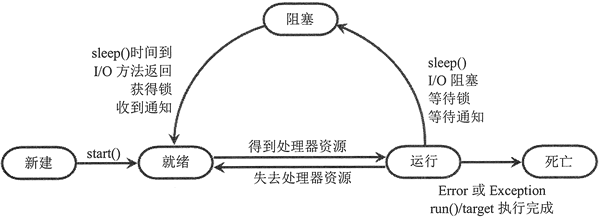

# Python线程和进程

**并发：同一时刻有多个任务可以执行**

**并行：同一个时刻只有一个任务可以执行**

## 线程

所有的操作系统都支持同时运行多个任务，每个任务通常是一个程序，每一个运行的程序就是一个进程。进程是应用程序的执行实例。现在的操作几乎都支持多进程并发执行。

**线程是程序执行的最小单位，进程是操作系统资源分配的最小单位。**

线程是进程的组成部分，一个进程可以包含多个线程。在多线程中，会有一个主线程来完成整个进程从开始到结束的全部操作，其他的线程会在主线程运行过程中被创建或退出。当进程被初始化了，主线程也就被创建了，对于绝大多数的应用程序来说，通常仅要求有一个主线程，但也可以在进程中创建多个顺序执行流，这些执行流就是线程。

每个线程都会有自己的父进程，并且可以拥有自己的堆栈、程序计算器和局部变量，但是不拥有系统资源，因为父进程和其他线程共享该进程中拥有的所有的系统资源。线程可以完成一部分任务，可以与其他线程共享父进程中拥有的共享变量及部分环境，相互协同完成进程索所要完成的任务。

**多个线程共享父进程中所有资源，线程不会影响同一进程中的其他线程**

线程之间是独立运行的，同一个进程中的线程并不知道进程是否还有其他线程，线程的运行是抢占式的，也就是说，当前运行的线程在任何时候都有可能会被挂起，以便于其他线程的运行。

多线程是并发执行，但是在python中，同一时刻只允许一个线程运行，这和GIL(全局解释器)锁有关。

一个线程可以创建或者撤销一个线程，同一个进程中的线程可以并发运行。

**线程和进程的关系：操作系统可以同时执行多个任务，每一个任务就是一个进程，进程可以同时执行多个任务，每一个任务就是一个线程。**

## **Python中创建线程的方式**

**Python3中创建线程的方式有两种**

1. 直接使用threading模块中的Thread类来进行线程的创建。即对类threading.Thread进行实例化创建线程，并调用实例对象的start方法启动线程。
2. 继承threading模块中的Thread类来创建线程类。即用thread.Thread派生出一个新的子类，将新建类实例化创建线程，并调用实例化对象的start方法启动线程。

Thread类提供的方法

```
__init__(self, group=None, target=None, name=None, args=(), kwargs=None, *,daemon=None)
参数解析：
	group:指定创建的线程属于那个线程组，该参数尚未实现，无需调用
	target:指定线程调用的任务
	name:线程的名字
	args:以元组的方式，为target指定方法传递参数
	kwargs:以字典的方式，为target指定方法传递参数
	daemon:守护线程，主线程结束后，所有子线程也要结束
```

## 线程的生命周期



线程从创建到消亡的过程会经历5个状态，分别是:新建、就绪、运行、阻塞、死亡

新建：当线程被创建，在未调用start方法之前，线程都是处于新建状态。当新建状态的线程调用了start方法，线程状态就从新建状态进入就绪状态。

就绪：告诉CPU，线程可以进行执行了，但是具体什么时候执行，取决于CPU什么时候调度。如果一个线程进入了就绪状态，只能说明该线程做好了被CPU调度的准备，并不是调用了start方法就会立即被执行。start方法只能被新建状态的线程进行调用，这就意味着每个线程只会调用一次start方法，如果多次调用start方法，python解释器会抛出RuntimError异常

**注意：线程从新建状态进入就绪状态，只有一个办法，就是调用start方法。**

直接调用Thread类中调用构造方法指定的函数，或者直接调用Thread子类中的run实例方法，无法从新建状态转到就绪状态。这两种方法都可以进行执行目标代码，但是是由主线程MainThread负责执行，不是由新创建的子线程进行执行。原因很简单：一方面Python解释器会将它们看成是普通的函数调用和类方法调用。另一方面，由于新建的线程属于新建状态不属于就绪状态，得不到CPU的调度。

