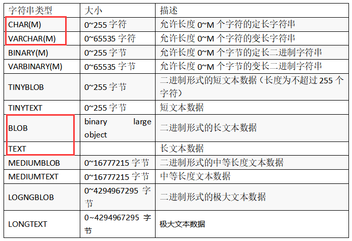
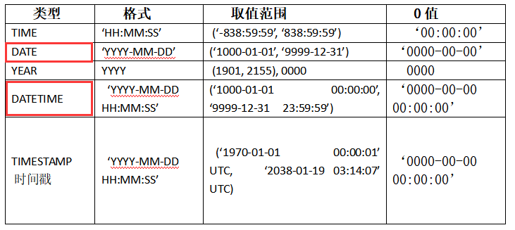

# 数据库

## SQL语言的组成

**SQL语言分为5个部分**

- 数据查询语言(DQL):DQL主要用于数据的查询，其基本结构是使用SELECT语句,FROM子句和WHERE子句的组合来查询一条数据或者多条数据
- 数据定义语言(DDL):DDL主要针对数据库对象(数据库、表、索引、视图、触发器、存储过程、函数)进行创建、删除、修改操作。主要包括：
  - CREATE：创建数据库对象
  - ALTER：修改数据库对象
  - DROP:删除数据库对象
- 数据操作语言(DML):DML主要针对数据库中的增删改操作，主要包括：
  - INSERT:增加数据
  - UPDATE:修改数据
  - DELETE:删除数据

- 数据控制语言(DCL):DCL用来授权或者回收访问数据库的权限，主要包括：
  - GRANT：授予用户某种权限
  - REVOKE：回收用户某种权限
- 事务控制语言(TCL):TCL用于数据库的事务管理。主要包括：
  - START TRANSACTION:开启事务
  - COMMIT:提交事务
  - ROLLBACK：回滚事务
  - SET TRANSACTION:设置事务属性

## MySQL的数据类型

### 1.整数类型


MySQL支持选择在该类型关键字后面的括号内指定整数值的显示宽度(例如，INT(4))。**显示宽度并不限制可以在列内保存的值的范围，也不限制超过列的指定宽度的值的显示**
主键自增：不使用序列，通过auto_increment，要求是整数类型

### 2.浮点数类型


与整数类型不同的是，浮点数类型的宽度不会进行自动扩充

lg:

​	score double(4, 1): 宽度为4，小数位为1位，总宽度为4，不会进行自动扩充

### 3.字符串类型



CHAR和VARCHAR类型相似，均用于存储较短的字符串，主要的不同的是。**CHAR长度固定,VARCHAR长度可变**

因为VARCHAR类型能够根据字符串的实际长度来动态改变所占字节的大小，所以在不能明确该字段具体需要多少字符时推荐使用VARCHAR类型，这样可以大大地节约磁盘空间、提高存储效率。
CHAR和VARCHAR表示的是字符的个数，而不是字节的个数

### 4.日期和时间类型



TIMESTEMP类型的数据指定方式与DATETIME基本相同，两者的不同之处在于以下几点：
(1) 数据的取值范围不同，TIMESTEMP类型的取值范围更小。
(2) 如果我们对TIMESTAMP类型的字段没有明确赋值，或是被赋与了NULL值，MySQL会自动将该字段赋值为系统当前的日期与时间。
(3) TIMESTEMP类型还可以使用CURRENT_TIMESTAMP来获取系统当前时间。
(4) TIMESTEMP类型有一个很大的特点，那就是时间是根据时区来显示的。例如，在东八区插入的TIMESTEMP数据为2017-07-11 16:43:25，在东七区显示时，时间部分就变成了15:43:25，在东九区显示时，时间部分就变成了17:43:25。 


## MySQL基本语法

### 创建数据库

语法：

```
create database 数据库名; 
查看所有的数据库
	show databases;
```

lg:

```sql
create database test;
```

### 创建数据表

语法:

```
使用指定的数据库
	use 数据库名;
查看数据库中的数据表
	show tables;
创建数据表
	create table 数据表名 (字段名 数据类型, 字段名2 数据类型,...);
```

lg:

```sql
mysql> create table student(
    -> id int primary key auto_increment,
    -> name varchar(50) not null,
    -> age int(4) check(age>=18 and age <= 60),
    -> sex char(1) default '男' check(sex='男' || sex='女'),
    -> email varchar(255) unique,
    -> time date);
Query OK, 0 rows affected, 2 warnings (0.06 sec)
```

#### **查看建表语句**

```sql
mysql> show create table student;
```

#### **查看表结构**

```sql
mysql> desc student;
+-------+--------------+------+-----+---------+----------------+
| Field | Type         | Null | Key | Default | Extra          |
+-------+--------------+------+-----+---------+----------------+
| id    | int          | NO   | PRI | NULL    | auto_increment |
| name  | varchar(50)  | NO   |     | NULL    |                |
| age   | int          | YES  |     | NULL    |                |
| sex   | char(1)      | YES  |     | 男      |                |
| email | varchar(255) | YES  | UNI | NULL    |                |
| time  | date         | YES  |     | NULL    |                |
+-------+--------------+------+-----+---------+----------------+
6 rows in set (0.01 sec)
```

#### 快速创建一个数据表

- 数据表的数据，结构和目标表都一致

  ```
  语法：create table 表名 as select * from 目标表名;
  ```

  ```sql
  mysql> create table student1 as select * from student;
  ```

- 数据表的结构和目标表的结构一致，无数据

```
语法: create table 表名 as select * from 目标表名 where false;
```

```sql
mysql> create table student2 as select * from student where false;
Query OK, 0 rows affected (0.02 sec)
Records: 0  Duplicates: 0  Warnings: 0
```

- 数据表的部分结构和部分数据和目标表一致

  ```
  语法：create table 表名 as select 字段名1,字段名2,字段名3... from 目标表 where 条件;
  ```

  ```sql
  mysql> create table student3 as select id, name, age from student;
  Query OK, 0 rows affected (0.03 sec)
  Records: 0  Duplicates: 0  Warnings: 0
  ```

### 删除数据库

```
drop database 数据库名;
```

### 删除数据表

```
drop table 数据表名;
```

### 添加数据

**注意：**

- int  宽度是显示宽度，如果超过，可以自动增大宽度 int底层都是4个字节
- 时间的方式多样  '1256-12-23'  "1256/12/23"  "1256.12.23"
- 字符串不区分单引号和双引号
- 如何写入当前的时间  now() , sysdate() , CURRENT_DATE()
- char varchar 是字符的个数，不是字节的个数，可以使用binary，varbinary表示定长和不定长的字节个数。
- 如果不是全字段插入数据的话，需要加入字段的名字

#### 添加一条数据

```
语法: insert into 数据表名 values();
```

```sql
mysql> insert into student values (1, '李梅', 19, '女','0001@163.com', now());
Query OK, 1 row affected, 1 warning (0.00 sec)
```

#### 添加多条数据

```
语法: insert into 数据表名 values (), ();
```

```sql
mysql> insert into student values (2, '王五', 22, '男', '0002@163.com', now()), (3, '李四', 23, '男', '0003@163.com', now());
Query OK, 2 rows affected, 2 warnings (0.01 sec)
Records: 2  Duplicates: 0  Warnings: 2
```

#### 添加部分数据

```
语法: insert into 数据表名(字段名1,字段名2,字段名3...) values ();
```

```sql
mysql> insert into student(id, name, age) values (4, '丽丽', 21);
Query OK, 1 row affected (0.01 sec)
```

### 修改数据

#### 修改数据库结构

##### 数据库增加一列

```
数据库增加一列默认增加到最后，可以指定位置
语法: 
	alter table 数据表名 add 字段名 数据类型;
增加到开头:
	alter table 数据表名 add 字段名 数据类型 first;
增加到字段后面:
	alter table 数据表名 add 字段名 数据类型 after 字段名;
```

```sql
mysql> alter table student3 add time_ date;
Query OK, 0 rows affected (0.03 sec)
Records: 0  Duplicates: 0  Warnings: 0
```

```sql
mysql> alter table student3 add sex char(1) first;
Query OK, 0 rows affected (0.05 sec)
Records: 0  Duplicates: 0  Warnings: 0
```

```sql
mysql> alter table student3 add email varchar(255) after id;
Query OK, 0 rows affected (0.04 sec)
Records: 0  Duplicates: 0  Warnings: 0
```

##### 数据库删除一列

```
语法:	alter table 数据表名 drop 字段名;
```

```sql
mysql> alter table student3 drop sex;
Query OK, 0 rows affected (0.05 sec)
Records: 0  Duplicates: 0  Warnings: 0
```

##### 数据库修改列名，数据类型

```
语法:
	① 使用modify  modify只能修改列的数据类型，无法修改名字
	alter table 表名 modify 字段名 修改后的数据类型;
	② 使用change change可以修改列的数据类型和名字
	alter table 表名 chagne 修改前的字段名 修改后的字段名 修改后的数据类型;
```

```sql
mysql> alter table student3 modify id int;
Query OK, 0 rows affected (0.04 sec)
Records: 0  Duplicates: 0  Warnings: 0
```

```sql
mysql> alter table student3 change name 名字 varchar(200);
Query OK, 0 rows affected (0.05 sec)
Records: 0  Duplicates: 0  Warnings: 0
```

#### 修改数据表数据

**注意：**

- 关键字，表名，字段名不区分大小写
- 默认情况下，内容不区分大小写
- 删除操作from关键字不可缺少
- 修改，删除数据别忘记加限制条件

##### **修改数据**

```
update 数据表名 set 字段名=值 where 条件;
```

```sql
mysql> update stu5 set age=80 where id=2;
Query OK, 1 row affected (0.00 sec)
Rows matched: 1  Changed: 1  Warnings: 0

mysql> update stu5 set age=80 where name='李四';
Query OK, 1 row affected (0.01 sec)
Rows matched: 1  Changed: 1  Warnings: 0
```

##### 删除数据

```
语法: delete from 表名 where 条件;
```

```sql
mysql> delete from stu5 where id = 2;
Query OK, 1 row affected (0.01 sec)
```

### 数据库约束

#### 非外键约束

**非外键的约束的分类**

- 主键约束   primary key

  ```
  添加:alter table 表名 add constraint 约束名字 primary key (数据表字段名);
  删除:alter table 表名 drop primary key;
  ```

  ```sql
  mysql> alter table stu5 add constraint id_con primary key (id);
  Query OK, 0 rows affected (0.04 sec)
  Records: 0  Duplicates: 0  Warnings: 0
  ```

  ```sql
  mysql> alter table stu5 drop primary key;
  Query OK, 3 rows affected (0.05 sec)
  Records: 3  Duplicates: 0  Warnings: 0
  ```

- 唯一约束   unique

  ```
  添加：alter table 表名 add constraint 唯一约束的名字 unique(数据表字段名);
  删除：alter table 表名 drop index 唯一约束的名字;
  ```

  ```sql
  mysql> alter table stu5 add constraint name_conn unique (name);
  Query OK, 0 rows affected (0.03 sec)
  Records: 0  Duplicates: 0  Warnings: 0
  ```

- 非空约束  not null

  ```
  方式一：change
      添加: alter table 表名 change column 字段名 字段名 数据类型 not null
      删除: alter table 表名 change column 字段名 字段名 数据类型  null;
  方式二：modify
  	添加: alter table 表名 modify 字段名 数据类型 not null;
  	删除: alter table 表名 modify 字段名 数据类型 null;
  ```

  ```sql
  mysql> alter table stu5 change column age age int(3) not null;
  Query OK, 0 rows affected, 1 warning (0.05 sec)
  Records: 0  Duplicates: 0  Warnings: 1
  ```

  ```sql
  mysql> alter table stu5 change column age age int(3) null;
  Query OK, 0 rows affected, 1 warning (0.06 sec)
  Records: 0  Duplicates: 0  Warnings: 1
  ```

- 检查约束  check

  ```
  添加: alter table 表名 add constraint 约束名字  check(条件);
  删除: alter table 表名 drop check check约束名字;
  ```

  ```sql
  mysql> alter table stu5 add constraint sex_conn check(sex='男' || sex='女');
  Query OK, 3 rows affected, 1 warning (0.08 sec)
  Records: 3  Duplicates: 0  Warnings: 1
  ```

- 默认值约束  default

  ```sql
  添加：alter table 表名 modify 字段名 数据类型 default 值;
  删除：alter table 表名 modify 字段名 数据类型;
  ```

  ```sql
  alter table stu5
      modify email varchar(255) default '111@163.COM';
  ```

  ```sql
  alter table stu5
      modify email varchar(255);
  ```

- 字段值自增约束  auto_increment

  ```
  使用modify的方式添加自增约束
  	alter table 表名 modify 字段 数据类型 auto_increment
  使用modify的方式删除自增约束
  	alter table 表名 modfiy 字段 数据类型;
  ```

**在创建数据表时添加非外键约束**

```sql
mysql> create table stu1 (
    id int, name varchar(32) not null, 
    age int(32), sex char(1) default '男', 
    email varchar(20), 
    constraint id_conn primary key(id),
    constraint age_conn check(age>=18 and age <= 60), 
    constraint sex_conn check(sex='男' || sex='女'), 
    constraint email_conn unique(email));
Query OK, 0 rows affected, 2 warnings (0.02 sec)
```

**总结：**

- 数据表创建以后添加非外键约束
  - 添加主键约束，使用add constraint
  - 添加check约束，使用add constraint
  - 添加unique约束，使用add constraint
  - 添加默认值约束，使用modify
  - 添加自增约束，使用modify
  - 添加非空约束，使用modify或者change
- 数据表创建时添加约束
  - 默认值约束和非空值约束直接在字段后面添加
  - 主键约束使用constraint添加
  - 唯一性约束使用constraint添加
  - check约束使用constraint添加
  - 自增约束使用modify

#### 外键约束

外键约束是用来实现数据库的参照完整性的。外键约束可以使两张表紧密的联系在一起，特别是进行数据的删除或者修改的级联操作时，会保证数据的完整性。

外键是指表中某个字段的值依赖于另一张表中某个字段的值，而被依赖的字段必须具有主键约束或者唯一约束。**被依赖的表我们通常称之为父表或者主表，设置外键约束的表称为子表或者从表。**

**注意：外键约束只有表级约束，没有列级约束**

**如果给从表添加了外键，但是没有添加外键约束，那么所添加的外键只是属于逻辑上的外键，并不是真正的外键。**

**添加了外键以后，需要先删除从表，再删除主表。**

```
语法： alter table 子表 add constraint 外键名字 foreign key(子表中的外键字段) references 主表(主表id);
```

```sql
mysql> alter table stu add constraint s_c  foreign key (c_id) references class(c_id);
Query OK, 3 rows affected (0.05 sec)
Records: 3  Duplicates: 0  Warnings: 0
```

#### 外键策略

添加外键后,无法直接删除主表。对于需要删除主表的情况，需要添加外键策略。

添加外键策略：

- no action 不允许操作，将从表的外键设置为null,然后删除主表里的内容

  将从表里的外键设置为null

  ```sql
  mysql> update stu set c_id=null where id=6;
  Query OK, 1 row affected (0.00 sec)
  Rows matched: 1  Changed: 1  Warnings: 0
  ```

  查看是否设置成功

  ```sql
  mysql> select * from stu;
  +----+--------+------+------+
  | id | name   | sex  | c_id |
  +----+--------+------+------+
  |  1 | 李梅   | 女   |    1 |
  |  2 | 李四   | 男   |    2 |
  |  3 | 丽丽   | 女   |    3 |
  |  4 | w      | 男   |    4 |
  |  5 | r      | 男   |    5 |
  |  6 | y      | 男   | NULL |
  +----+--------+------+------+
  6 rows in set (0.00 sec)
  ```

  删除主表里面对应的id

  ```sql
  mysql> delete from class where c_id = 6;
  Query OK, 1 row affected (0.01 sec)
  ```

- cascade级联操作 先删除之前的外键，然后重新设置外键约束

  先删除外键

  ```
  语法：alter table 从表 foreign key 外键名称;
  ```

  ```sql
  mysql> alter table stu drop foreign key s_c;
  Query OK, 0 rows affected (0.02 sec)
  Records: 0  Duplicates: 0  Warnings: 0
  ```

  重新设置外键约束

  ```
  语法：alter table 从表 add constraint 外键名称 foreign key (从表外键) references 主表(主表id) on update cascade on delete cascade;
  ```

  ```sql
  mysql> alter table stu add constraint s_c foreign key (c_id) references class(c_id) on update cascade on delete cascade;
  Query OK, 6 rows affected (0.06 sec)
  Records: 6  Duplicates: 0  Warnings: 0
  ```

  执行删除或者修改操作

  ```sql
  mysql> delete from class where id = 5;
  ERROR 1054 (42S22): Unknown column 'id' in 'where clause'
  mysql> delete from class where c_id = 5;
  Query OK, 1 row affected (0.00 sec)
  ```

- set null 置空操作 先删除之前的外键，然后重新设置外键约束

先删除外键

```
语法：alter table 从表 drop foreign key 外键名字;
```

```sql
mysql> alter table stu drop foreign key s_c;
Query OK, 0 rows affected (0.01 sec)
Records: 0  Duplicates: 0  Warnings: 0
```

重新添加外键约束，加上置空

```
语法:alter table 从表 add constraint 外键名字 foreign key (从表外键) references 主表 (主表id) on update set null on delete set null;
```

```sql
mysql> alter table stu add constraint s_c foreign key(c_id) references class(c_id) on update set null on delete set null;
Query OK, 5 rows affected (0.05 sec)
Records: 5  Duplicates: 0  Warnings: 0
```

然后可以进行更新或者删除操作

```sql
mysql> update stu set name='ww' where id = 4;
Query OK, 1 row affected (0.00 sec)
Rows matched: 1  Changed: 1  Warnings: 0
```

### 数据库查询

#### **查询表的所有数据**

```
语法： select * from 表;
```

```sql
mysql> select * from stu;
+----+--------+------+------+------+
| id | name   | sex  | c_id | age  |
+----+--------+------+------+------+
|  1 | 李梅   | 女   |    1 |   18 |
|  2 | 李四   | 男   |    2 |   18 |
|  3 | 丽丽   | 女   |    3 |   18 |
|  4 | ww     | 男   |    4 |   32 |
|  6 | y      | 男   | NULL |   23 |
+----+--------+------+------+------+
5 rows in set (0.00 sec)
```

#### **查询部分列**

```
语法： select 字段名1, 字段名2,... from 表;
```

```sql
mysql> select id, name, sex from stu;
+----+--------+------+
| id | name   | sex  |
+----+--------+------+
|  1 | 李梅   | 女   |
|  2 | 李四   | 男   |
|  3 | 丽丽   | 女   |
|  4 | ww     | 男   |
|  6 | y      | 男   |
+----+--------+------+
5 rows in set (0.00 sec)
```

#### **查询部分行**

```
语法： select * from 表 where 条件;
```

```sql
mysql> select * from stu where age > 18;
+----+------+------+------+------+
| id | name | sex  | c_id | age  |
+----+------+------+------+------+
|  4 | ww   | 男   |    4 |   32 |
|  6 | y    | 男   | NULL |   23 |
+----+------+------+------+------+
2 rows in set (0.00 sec)
```

#### **查询部分列，部分行**

```
语法: select 字段名1, 字段名2, ... from 表 where 条件;
```

```sql
mysql> select id, name,age from stu where age > 18;
+----+------+------+
| id | name | age  |
+----+------+------+
|  4 | ww   |   32 |
|  6 | y    |   23 |
+----+------+------+
2 rows in set (0.00 sec)
```

#### **别名**

```
语法：
	① select 字段名 别名, 字段名 别名,... from 表;
	② select 字段名 as 别名, 字段名 as 别名, ... from 表;
	③ select 字段名 '别名', 字段名 '别名',... from 表;
```

```sql
mysql> select id 序号, name 姓名, age 年龄 from stu;
+--------+--------+--------+
| 序号   | 姓名   | 年龄   |
+--------+--------+--------+
|      1 | 李梅   |     18 |
|      2 | 李四   |     18 |
|      3 | 丽丽   |     18 |
|      4 | ww     |     32 |
|      6 | y      |     23 |
+--------+--------+--------+
5 rows in set (0.00 sec)
```

```sql
mysql> select id as 序号, name as 姓名, age as 年龄 from stu;
+--------+--------+--------+
| 序号   | 姓名   | 年龄   |
+--------+--------+--------+
|      1 | 李梅   |     18 |
|      2 | 李四   |     18 |
|      3 | 丽丽   |     18 |
|      4 | ww     |     32 |
|      6 | y      |     23 |
+--------+--------+--------+
5 rows in set (0.00 sec)
```

```sql
mysql> select id '序号', name '姓名', age '年龄' from stu;
+--------+--------+--------+
| 序号   | 姓名   | 年龄   |
+--------+--------+--------+
|      1 | 李梅   |     18 |
|      2 | 李四   |     18 |
|      3 | 丽丽   |     18 |
|      4 | ww     |     32 |
|      6 | y      |     23 |
+--------+--------+--------+
5 rows in set (0.00 sec)
```

**注意：**

- 当别名含有特殊符号时，引号不能省略
- 别名的引号要一致

#### **算术运算符**

**加法运算**

```
语法： select 字段名, 字段名 + 数值 from 表;
```

```sql
mysql> select id, name, sal, sal + 10000 涨薪后 from stu;
+----+--------+-------+-----------+
| id | name   | sal   | 涨薪后    |
+----+--------+-------+-----------+
|  1 | 李梅   | 10000 |     20000 |
|  2 | 李四   |  4000 |     14000 |
|  3 | 丽丽   | 12000 |     22000 |
|  4 | ww     |  4000 |     14000 |
|  6 | y      |  4000 |     14000 |
+----+--------+-------+-----------+
5 rows in set (0.00 sec)
```

#### **去重**

**对单独一列去重**

```
语法： select distinct 列名 from 表;
```

```sql
mysql> select distinct sal from stu;
+-------+
| sal   |
+-------+
| 10000 |
|  4000 |
| 12000 |
+-------+
3 rows in set (0.00 sec)
```

**对组合列去重**

```
语法: select distinct 列名, 列名 from 表;
```

```sql
mysql> select distinct sal,name from stu;
+-------+--------+
| sal   | name   |
+-------+--------+
| 10000 | 李梅   |
|  4000 | 李四   |
| 12000 | 丽丽   |
|  4000 | ww     |
|  4000 | y      |
+-------+--------+
5 rows in set (0.00 sec)
```

#### 排序

##### 升序

排序默认是升序

```
语法:
	select * from 表 order by 字段;      升序
	select * from 表 order by 字段 asc;  升序
```

```sql
mysql> select * from stu order by sal asc;
+----+--------+------+------+------+-------+
| id | name   | sex  | c_id | age  | sal   |
+----+--------+------+------+------+-------+
|  2 | 李四   | 男   |    2 |   18 |  4000 |
|  4 | ww     | 男   |    4 |   32 |  4000 |
|  6 | y      | 男   | NULL |   23 |  4000 |
|  1 | 李梅   | 女   |    1 |   18 | 10000 |
|  3 | 丽丽   | 女   |    3 |   18 | 12000 |
+----+--------+------+------+------+-------+
5 rows in set (0.00 sec)
```

```sql
mysql> select * from stu order by sal;
+----+--------+------+------+------+-------+
| id | name   | sex  | c_id | age  | sal   |
+----+--------+------+------+------+-------+
|  2 | 李四   | 男   |    2 |   18 |  4000 |
|  4 | ww     | 男   |    4 |   32 |  4000 |
|  6 | y      | 男   | NULL |   23 |  4000 |
|  1 | 李梅   | 女   |    1 |   18 | 10000 |
|  3 | 丽丽   | 女   |    3 |   18 | 12000 |
+----+--------+------+------+------+-------+
5 rows in set (0.00 sec)
```

##### 降序

```
语法:select * from 表 order by 字段 desc;
```

```sql
mysql> select * from stu order by sal desc;
+----+--------+------+------+------+-------+
| id | name   | sex  | c_id | age  | sal   |
+----+--------+------+------+------+-------+
|  3 | 丽丽   | 女   |    3 |   18 | 12000 |
|  1 | 李梅   | 女   |    1 |   18 | 10000 |
|  2 | 李四   | 男   |    2 |   18 |  4000 |
|  4 | ww     | 男   |    4 |   32 |  4000 |
|  6 | y      | 男   | NULL |   23 |  4000 |
+----+--------+------+------+------+-------+
5 rows in set (0.00 sec)
```

#### where子句

##### **where子句+关系运算符**

```
语法: select * from 表 where 关系运算符;
关系运算符:
	> 大于
	< 小于
	<= 小于等于
	>= 大于等于
	!= 不等于
	<> 不等于
```

```sql
mysql> select * from stu where sal > 10000;
+----+--------+------+------+------+-------+
| id | name   | sex  | c_id | age  | sal   |
+----+--------+------+------+------+-------+
|  3 | 丽丽   | 女   |    3 |   18 | 12000 |
+----+--------+------+------+------+-------+
1 row in set (0.00 sec)

mysql> select * from stu where sal >= 10000;
+----+--------+------+------+------+-------+
| id | name   | sex  | c_id | age  | sal   |
+----+--------+------+------+------+-------+
|  1 | 李梅   | 女   |    1 |   18 | 10000 |
|  3 | 丽丽   | 女   |    3 |   18 | 12000 |
+----+--------+------+------+------+-------+
2 rows in set (0.00 sec)
```

##### **where子句+逻辑运算符and**

```
语法：select * from 表 where 条件;
```

```sql
mysql> select * from stu where age >= 18 and sal >= 10000;
+----+--------+------+------+------+-------+------------+
| id | name   | sex  | c_id | age  | sal   | time       |
+----+--------+------+------+------+-------+------------+
|  1 | 李梅   | 女   |    1 |   18 | 10000 | 2021-08-20 |
|  3 | 丽丽   | 女   |    3 |   18 | 12000 | 2021-08-20 |
+----+--------+------+------+------+-------+------------+
2 rows in set (0.00 sec)
```

##### **where子句+逻辑运算符or**

```
语法： select * from stu 表 where 条件;
```

```sql
mysql> select * from stu where age > 18 or sal > 10000;
+----+--------+------+------+------+-------+------------+
| id | name   | sex  | c_id | age  | sal   | time       |
+----+--------+------+------+------+-------+------------+
|  3 | 丽丽   | 女   |    3 |   18 | 12000 | 2021-08-20 |
|  4 | ww     | 男   |    4 |   32 |  4000 | 2021-08-20 |
|  6 | y      | 男   | NULL |   23 |  4000 | 2021-08-20 |
+----+--------+------+------+------+-------+------------+
3 rows in set (0.00 sec)
```

##### **where子句加模糊查询**

###### 以...开头

```
语法: select * from 表 where 字段名 like '%条件%';
```

```sql
mysql> select * from stu where name like '%李%';
+----+--------+------+------+------+-------+------------+
| id | name   | sex  | c_id | age  | sal   | time       |
+----+--------+------+------+------+-------+------------+
|  1 | 李梅   | 女   |    1 |   18 | 10000 | 2021-08-20 |
|  2 | 李四   | 男   |    2 |   18 |  4000 | 2021-08-20 |
|  7 | 李武   | 男   |    3 |   18 | 10000 | 2021-08-20 |
+----+--------+------+------+------+-------+------------+
3 rows in set (0.00 sec)
```

###### 查询位于中间的位置

```
语法： select * from 表 where like '_条件%';
```

```sql
mysql> select * from stu where name like '_李%';
+----+--------+------+------+------+------+------+
| id | name   | sex  | c_id | age  | sal  | time |
+----+--------+------+------+------+------+------+
|  8 | 张李   | 男   | NULL |   18 | NULL | NULL |
+----+--------+------+------+------+------+------+
1 row in set (0.00 sec)
```

###### 查询结束的位置

```
语法: select * from 表 where like '__条件%';
```

```sql
mysql> select * from stu where name like '_李%';
+----+--------+------+------+------+------+------+
| id | name   | sex  | c_id | age  | sal  | time |
+----+--------+------+------+------+------+------+
|  8 | 张李   | 男   | NULL |   18 | NULL | NULL |
+----+--------+------+------+------+------+------+
1 row in set (0.00 sec)
```

#### 关于null的判断

```
语法: 
	select * from 表 where 字段名 is null;
	select * from 表 where 字段名 is not null;
```

```sql
mysql> select * from stu where sal is null;
+----+-----------+------+------+------+------+------+
| id | name      | sex  | c_id | age  | sal  | time |
+----+-----------+------+------+------+------+------+
|  8 | 张李      | 男   | NULL |   18 | NULL | NULL |
|  9 | 张张李    | 男   | NULL |   18 | NULL | NULL |
+----+-----------+------+------+------+------+------+
2 rows in set (0.00 sec)

mysql> select * from stu where sal is  not null;
+----+--------+------+------+------+-------+------------+
| id | name   | sex  | c_id | age  | sal   | time       |
+----+--------+------+------+------+-------+------------+
|  1 | 李梅   | 女   |    1 |   18 | 10000 | 2021-08-20 |
|  2 | 李四   | 男   |    2 |   18 |  4000 | 2021-08-20 |
|  3 | 丽丽   | 女   |    3 |   18 | 12000 | 2021-08-20 |
|  4 | ww     | 男   |    4 |   32 |  4000 | 2021-08-20 |
|  6 | y      | 男   | NULL |   23 |  4000 | 2021-08-20 |
|  7 | 李武   | 男   |    3 |   18 | 10000 | 2021-08-20 |
+----+--------+------+------+------+-------+------------+
6 rows in set (0.00 sec)
```

#### 小括号的使用

由于优先级的不同，加小括号可以增强可读性

and的优先级高于or 先and再or

```sql
mysql> select * from stu where sal > 10000 or name >=18 and sex='女';
+----+--------+------+------+------+-------+------------+
| id | name   | sex  | c_id | age  | sal   | time       |
+----+--------+------+------+------+-------+------------+
|  3 | 丽丽   | 女   |    3 |   18 | 12000 | 2021-08-20 |
+----+--------+------+------+------+-------+------------+
1 row in set, 6 warnings (0.00 sec)

mysql> select * from stu where (sal > 10000 or name >=18) and sex='女';
+----+--------+------+------+------+-------+------------+
| id | name   | sex  | c_id | age  | sal   | time       |
+----+--------+------+------+------+-------+------------+
|  3 | 丽丽   | 女   |    3 |   18 | 12000 | 2021-08-20 |
+----+--------+------+------+------+-------+------------+
1 row in set, 6 warnings (0.00 sec)

mysql> select * from stu where sal > 10000 or (name >=18 and sex='女');
+----+--------+------+------+------+-------+------------+
| id | name   | sex  | c_id | age  | sal   | time       |
+----+--------+------+------+------+-------+------------+
|  3 | 丽丽   | 女   |    3 |   18 | 12000 | 2021-08-20 |
+----+--------+------+------+------+-------+------------+
1 row in set, 6 warnings (0.00 sec)
```

#### 函数

##### 单行函数

单行函数包括：

- 字符串函数

  - length:字符串的长度
  - substring：截取字符串 sbustring(name, 2, 3):截取字段name，从下标2开始，截取的长度为3  **mysql的下标从1开始**

  ```
  语法: 
  	select length(字段名) from 表;
  	select substring(字段名, start, stop) from 表;
  ```

  ```sql
  mysql> select length(name) from stu;
  +--------------+
  | length(name) |
  +--------------+
  |            6 |
  |            6 |
  |            6 |
  |            2 |
  |            1 |
  |            6 |
  |            6 |
  |            9 |
  +--------------+
  8 rows in set (0.00 sec)
  
  mysql> select substring(name, 1, 3) from stu;
  +-----------------------+
  | substring(name, 1, 3) |
  +-----------------------+
  | 李梅                  |
  | 李四                  |
  | 丽丽                  |
  | ww                    |
  | y                     |
  | 李武                  |
  | 张李                  |
  | 张张李                |
  +-----------------------+
  8 rows in set (0.00 sec)
  ```

- 数值函数

  - abs():绝对值
  - ceil:向上取整
  - floor:向下取整
  - round():四舍五入
  - mod():返回余数

  **dual是伪表**

  ```sql
  mysql> select abs(-4), ceil(3.4), floor(3.2), round(4.5), mod(5, 4) from dual;
  +---------+-----------+------------+------------+-----------+
  | abs(-4) | ceil(3.4) | floor(3.2) | round(4.5) | mod(5, 4) |
  +---------+-----------+------------+------------+-----------+
  |       4 |         4 |          3 |          5 |         1 |
  +---------+-----------+------------+------------+-----------+
  1 row in set (0.00 sec)
  ```

- 日期与时间函数

  - curdate(): 年月日
  - curtime:():时分秒
  - now():年月日时分秒
  - sysdate:年月日时分秒
  - slepp(time):等待指定的时间

  ```sql
  mysql> select curdate(),now(), sysdate(), sleep(3), curtime() from dual;
  +------------+---------------------+---------------------+----------+-----------+
  | curdate()  | now()               | sysdate()           | sleep(3) | curtime() |
  +------------+---------------------+---------------------+----------+-----------+
  | 2021-08-20 | 2021-08-20 10:51:30 | 2021-08-20 10:51:30 |        0 | 10:51:30  |
  +------------+---------------------+---------------------+----------+-----------+
  1 row in set (3.00 sec)
  ```

##### 多行函数

多行函数分为：

- count():统计表中记录的条数

  - count(*), count(1) 都是可以统计总数,count(字段名) 统计字段的总数

  ```sql
  mysql> select count(*) from stu;
  +----------+
  | count(*) |
  +----------+
  |        8 |
  +----------+
  1 row in set (0.00 sec)
  
  mysql> select count(1) from stu;
  +----------+
  | count(1) |
  +----------+
  |        8 |
  +----------+
  1 row in set (0.00 sec)
  
  mysql> select count(name) from stu;
  +-------------+
  | count(name) |
  +-------------+
  |           8 |
  +-------------+
  1 row in set (0.00 sec)
  ```

- sum(): 计算字段的总和

- avg():计算字段的平均值

- max():计算字段的最大值

- min():计算字段的最小值

```sql
mysql> select sum(sal), avg(sal), max(sal), min(sal), count(sal) from stu;
+----------+-----------+----------+----------+------------+
| sum(sal) | avg(sal)  | max(sal) | min(sal) | count(sal) |
+----------+-----------+----------+----------+------------+
|    44000 | 7333.3333 |    12000 |     4000 |          6 |
+----------+-----------+----------+----------+------------+
1 row in set (0.00 sec)
```

#### 分组

```
语法: select 字段1,字段2,... from 表 group by 字段名;
```

```sql
mysql> select id, name from stu group by sex order by id;
+----+--------+
| id | name   |
+----+--------+
|  1 | 李梅   |
|  2 | 李四   |
+----+--------+
2 rows in set (0.00 sec)

mysql> select id, avg(sal) from stu group by sex;
+----+------------+
| id | avg(sal)   |
+----+------------+
|  1 | 11000.0000 |
|  2 |  5500.0000 |
+----+------------+
2 rows in set (0.00 sec)
```

#### having语句

having是分组后使用，where是分组前使用

```
语法: select 字段,字段,... from 表 group by 字段 having 条件;
```

```sql
mysql> select id, age, sal from stu group by sex having sex = '女';
+----+------+-------+
| id | age  | sal   |
+----+------+-------+
|  1 |   18 | 10000 |
+----+------+-------+
1 row in set (0.00 sec)
```

```
语法: select 字段,字段,.. from 表 where 条件 group by 字段;
```

```sql
mysql> select id, sal from stu where age >= 18 group by name order by sal desc;
+----+-------+
| id | sal   |
+----+-------+
|  3 | 12000 |
|  1 | 10000 |
|  7 | 10000 |
|  2 |  4000 |
|  4 |  4000 |
|  6 |  4000 |
|  8 |  NULL |
|  9 |  NULL |
+----+-------+
8 rows in set (0.00 sec)
```

#### 多表查询

实际开发中往往需要针对两张甚至更多张数据表进行操作，而这多张表之间需要使用主键和外键关联在一起，然后使用连接查询来查询多张表中满足要求的数据记录。

一条SQL语句查询多个表，得到一个结果，包含多个表的数据。效率高。在SQL99中，连接查询需要使用join关键字实现。

**提供了多种连接查询的类型： cross   natural   using   on**

交叉连接（CROSS JOIN）是对两个或者多个表进行笛卡儿积操作，所谓笛卡儿积就是关系代数里的一个概念，表示两个表中的每一行数据任意组合的结果。比如：有两个表，左表有m条数据记录，x个字段，右表有n条数据记录，y个字段，则执行交叉连接后将返回m*n条数据记录，x+y个字段。笛卡儿积示意图如图所示。  


##### 交叉连接cross join

交叉连接对两个表或者多个表进行笛卡尔积操作，笛卡尔积 就是关系代数里面的一个概念，表示两个表中的每一行数据任意组合的结果。例如：有两个表，左表有x条记录，m个字段，右表有y条记录,n个字段，在执行交叉连接时返回x*Y条记录，m+n个字段

```
cross join返回的是笛卡尔积，没有实际意义，有理论意义
语法：  MySQL中cross可以省略, oracle中不可以省略
	select * from 表 cross join 右表;
	select * from 表 join 右表;
```

```sql
mysql> select * from s cross join c;
```

##### 自然连接natural join

优点：所有同名列只出现一次，简单

缺点： 查询时，没有指定字段所属的数据库，效率低，解决：指定表名

缺点：有时由于表的名字过长，太麻烦，解决：使用别名

缺点：自然连接是匹配表中所有的同名列，但是有时候只需要匹配部分列，解决：使用内连接 using

```
语法: select * from 左表 natural join 右表;
```

```sql
mysql> select * from s natural join c;
+------+----+--------+------+------+----------+-----------+
| c_id | id | name   | sex  | age  | sal      | c_name    |
+------+----+--------+------+------+----------+-----------+
|    1 |  3 | 王五   | 男   |   34 |  1200.76 | 技术部    |
|    1 |  9 | 五     | 男   |   34 | 12000.76 | 技术部    |
|    2 |  1 | 李梅   | 女   |   21 |  1000.05 | 人事部    |
|    2 |  7 | 梅     | 女   |   21 | 10000.05 | 人事部    |
|    3 |  2 | 李四   | 男   |   23 |   120.98 | 销售部    |
|    3 |  8 | 李     | 男   |   23 |  1200.98 | 销售部    |
|    4 |  6 | 思思   | 女   |   20 |  1200.67 | 行政部    |
|    4 | 12 | 思     | 女   |   20 | 12000.67 | 行政部    |
|    5 |  4 | 丽丽   | 女   |   21 |  1300.09 | 财务部    |
|    5 | 10 | 丽     | 女   |   21 | 13000.09 | 财务部    |
|    6 |  5 | 赵六   | 男   |   22 |  1110.87 | 测试部    |
|    6 | 11 | 六     | 男   |   22 | 11010.87 | 测试部    |
+------+----+--------+------+------+----------+-----------+
12 rows in set (0.00 sec)
```

指定字段的表名

```
select 表.字段,表.字段,... from 表 natural join 表;
```

```sql
mysql> select s.id,s.name,s.age,s.sex,s.sal from s natural join c;
+----+--------+------+------+----------+
| id | name   | age  | sex  | sal      |
+----+--------+------+------+----------+
|  3 | 王五   |   34 | 男   |  1200.76 |
|  9 | 五     |   34 | 男   | 12000.76 |
|  1 | 李梅   |   21 | 女   |  1000.05 |
|  7 | 梅     |   21 | 女   | 10000.05 |
|  2 | 李四   |   23 | 男   |   120.98 |
|  8 | 李     |   23 | 男   |  1200.98 |
|  6 | 思思   |   20 | 女   |  1200.67 |
| 12 | 思     |   20 | 女   | 12000.67 |
|  4 | 丽丽   |   21 | 女   |  1300.09 |
| 10 | 丽     |   21 | 女   | 13000.09 |
|  5 | 赵六   |   22 | 男   |  1110.87 |
| 11 | 六     |   22 | 男   | 11010.87 |
+----+--------+------+------+----------+
12 rows in set (0.00 sec)
```

使用别名

```
select 别名.字段,别名.字段,... from 表 别名 natural join 表;
```

```sql
mysql> select e.id, e.name, e.age, e.sex, e.sal from s e natural join c;
+----+--------+------+------+----------+
| id | name   | age  | sex  | sal      |
+----+--------+------+------+----------+
|  3 | 王五   |   34 | 男   |  1200.76 |
|  9 | 五     |   34 | 男   | 12000.76 |
|  1 | 李梅   |   21 | 女   |  1000.05 |
|  7 | 梅     |   21 | 女   | 10000.05 |
|  2 | 李四   |   23 | 男   |   120.98 |
|  8 | 李     |   23 | 男   |  1200.98 |
|  6 | 思思   |   20 | 女   |  1200.67 |
| 12 | 思     |   20 | 女   | 12000.67 |
|  4 | 丽丽   |   21 | 女   |  1300.09 |
| 10 | 丽     |   21 | 女   | 13000.09 |
|  5 | 赵六   |   22 | 男   |  1110.87 |
| 11 | 六     |   22 | 男   | 11010.87 |
+----+--------+------+------+----------+
12 rows in set (0.00 sec)
```

##### 内连接using

using可以进行匹配部分同名列

缺点：using子句关联的字段，必须是同名的.解决：使用on子句

```
inner可以省略
语法: select * from 表 inner join 表 using(同名字段);
     select * from 表 inner join 表 using(同名字段) where 条件;
```

```sql
mysql> select * from s e inner join c t using(c_id);
+------+----+--------+------+------+----------+-----------+
| c_id | id | name   | sex  | age  | sal      | c_name    |
+------+----+--------+------+------+----------+-----------+
|    1 |  3 | 王五   | 男   |   34 |  1200.76 | 技术部    |
|    1 |  9 | 五     | 男   |   34 | 12000.76 | 技术部    |
|    2 |  1 | 李梅   | 女   |   21 |  1000.05 | 人事部    |
|    2 |  7 | 梅     | 女   |   21 | 10000.05 | 人事部    |
|    3 |  2 | 李四   | 男   |   23 |   120.98 | 销售部    |
|    3 |  8 | 李     | 男   |   23 |  1200.98 | 销售部    |
|    4 |  6 | 思思   | 女   |   20 |  1200.67 | 行政部    |
|    4 | 12 | 思     | 女   |   20 | 12000.67 | 行政部    |
|    5 |  4 | 丽丽   | 女   |   21 |  1300.09 | 财务部    |
|    5 | 10 | 丽     | 女   |   21 | 13000.09 | 财务部    |
|    6 |  5 | 赵六   | 男   |   22 |  1110.87 | 测试部    |
|    6 | 11 | 六     | 男   |   22 | 11010.87 | 测试部    |
+------+----+--------+------+------+----------+-----------+
12 rows in set (0.00 sec)
```

##### 内连接on

```
inner可以省略
语法：select * from 表1 inner join 表2 on(表1.字段名=表2.字段名);
	 select * from 表1 inner join 表2 on(表1.字段名=表2.字段名) where 条件;
```

```sql
mysql> select * from s e inner join c t on(e.c_id=t.c_id);
+----+--------+------+------+----------+------+------+-----------+
| id | name   | sex  | age  | sal      | c_id | c_id | c_name    |
+----+--------+------+------+----------+------+------+-----------+
|  3 | 王五   | 男   |   34 |  1200.76 |    1 |    1 | 技术部    |
|  9 | 五     | 男   |   34 | 12000.76 |    1 |    1 | 技术部    |
|  1 | 李梅   | 女   |   21 |  1000.05 |    2 |    2 | 人事部    |
|  7 | 梅     | 女   |   21 | 10000.05 |    2 |    2 | 人事部    |
|  2 | 李四   | 男   |   23 |   120.98 |    3 |    3 | 销售部    |
|  8 | 李     | 男   |   23 |  1200.98 |    3 |    3 | 销售部    |
|  6 | 思思   | 女   |   20 |  1200.67 |    4 |    4 | 行政部    |
| 12 | 思     | 女   |   20 | 12000.67 |    4 |    4 | 行政部    |
|  4 | 丽丽   | 女   |   21 |  1300.09 |    5 |    5 | 财务部    |
| 10 | 丽     | 女   |   21 | 13000.09 |    5 |    5 | 财务部    |
|  5 | 赵六   | 男   |   22 |  1110.87 |    6 |    6 | 测试部    |
| 11 | 六     | 男   |   22 | 11010.87 |    6 |    6 | 测试部    |
+----+--------+------+------+----------+------+------+-----------+
12 rows in set (0.00 sec)
```

##### 左外连接right outer join

on子句显示的所有的匹配的数据，外连接既可以显示不匹配的数据，也可以显示匹配的数据

```
语法： select * from 表1 left outer join 表2 on (表1.字段=表2.字段);
	  select * from 表1 left outer join 表2 on (表1.字段=表2.字段) where 条件;
```

```sql
mysql> select * from s left outer join c on (s.c_id=c.c_id);
+----+--------+------+------+----------+------+------+-----------+
| id | name   | sex  | age  | sal      | c_id | c_id | c_name    |
+----+--------+------+------+----------+------+------+-----------+
|  1 | 李梅   | 女   |   21 |  1000.05 |    2 |    2 | 人事部    |
|  2 | 李四   | 男   |   23 |   120.98 |    3 |    3 | 销售部    |
|  3 | 王五   | 男   |   34 |  1200.76 |    1 |    1 | 技术部    |
|  4 | 丽丽   | 女   |   21 |  1300.09 |    5 |    5 | 财务部    |
|  5 | 赵六   | 男   |   22 |  1110.87 |    6 |    6 | 测试部    |
|  6 | 思思   | 女   |   20 |  1200.67 |    4 |    4 | 行政部    |
|  7 | 梅     | 女   |   21 | 10000.05 |    2 |    2 | 人事部    |
|  8 | 李     | 男   |   23 |  1200.98 |    3 |    3 | 销售部    |
|  9 | 五     | 男   |   34 | 12000.76 |    1 |    1 | 技术部    |
| 10 | 丽     | 女   |   21 | 13000.09 |    5 |    5 | 财务部    |
| 11 | 六     | 男   |   22 | 11010.87 |    6 |    6 | 测试部    |
| 12 | 思     | 女   |   20 | 12000.67 |    4 |    4 | 行政部    |
+----+--------+------+------+----------+------+------+-----------+
12 rows in set (0.00 sec)
```

##### 右外连接right outer join

```
语法: select * from 表1 right outer join 表2 on (表1.字段=表2.字段);
	 select * from 表1 right outer join 表2 on (表1.字段=表2.字段) where 条件;
```

```sql
mysql> select * from s right outer join c on (s.c_id=c.c_id);
+------+--------+------+------+----------+------+------+-----------+
| id   | name   | sex  | age  | sal      | c_id | c_id | c_name    |
+------+--------+------+------+----------+------+------+-----------+
|    3 | 王五   | 男   |   34 |  1200.76 |    1 |    1 | 技术部    |
|    9 | 五     | 男   |   34 | 12000.76 |    1 |    1 | 技术部    |
|    1 | 李梅   | 女   |   21 |  1000.05 |    2 |    2 | 人事部    |
|    7 | 梅     | 女   |   21 | 10000.05 |    2 |    2 | 人事部    |
|    2 | 李四   | 男   |   23 |   120.98 |    3 |    3 | 销售部    |
|    8 | 李     | 男   |   23 |  1200.98 |    3 |    3 | 销售部    |
|    6 | 思思   | 女   |   20 |  1200.67 |    4 |    4 | 行政部    |
|   12 | 思     | 女   |   20 | 12000.67 |    4 |    4 | 行政部    |
|    4 | 丽丽   | 女   |   21 |  1300.09 |    5 |    5 | 财务部    |
|   10 | 丽     | 女   |   21 | 13000.09 |    5 |    5 | 财务部    |
|    5 | 赵六   | 男   |   22 |  1110.87 |    6 |    6 | 测试部    |
|   11 | 六     | 男   |   22 | 11010.87 |    6 |    6 | 测试部    |
+------+--------+------+------+----------+------+------+-----------+
12 rows in set (0.00 sec)
```

##### 全外连接

mysql中不支持全外连接 full outer join ,oracle支持

mysql中使用union和union all 进行替代.union:去重，效率低  union all：不去重，效率高

```
outer可以省略
语法：
	select * from 表1 left outer join 表2 on 表1.字段=表2.字段 union select * from 表1 right outer join 表2 on 表1.字段=表2.字段;
	select * from 表1 left outer join 表2 on 表1.字段=表2.字段 union all select * from 表1 right outer join 表2 on 表1.字段=表2.字段;
```

```sql
mysql> select * from s left outer join c on s.c_id=c.c_id union select * from s right outer join c on s.c_id=c.c_id;
+------+--------+------+------+----------+------+------+-----------+
| id   | name   | sex  | age  | sal      | c_id | c_id | c_name    |
+------+--------+------+------+----------+------+------+-----------+
|    1 | 李梅   | 女   |   21 |  1000.05 |    2 |    2 | 人事部    |
|    2 | 李四   | 男   |   23 |   120.98 |    3 |    3 | 销售部    |
|    3 | 王五   | 男   |   34 |  1200.76 |    1 |    1 | 技术部    |
|    4 | 丽丽   | 女   |   21 |  1300.09 |    5 |    5 | 财务部    |
|    5 | 赵六   | 男   |   22 |  1110.87 |    6 |    6 | 测试部    |
|    6 | 思思   | 女   |   20 |  1200.67 |    4 |    4 | 行政部    |
|    7 | 梅     | 女   |   21 | 10000.05 |    2 |    2 | 人事部    |
|    8 | 李     | 男   |   23 |  1200.98 |    3 |    3 | 销售部    |
|    9 | 五     | 男   |   34 | 12000.76 |    1 |    1 | 技术部    |
|   10 | 丽     | 女   |   21 | 13000.09 |    5 |    5 | 财务部    |
|   11 | 六     | 男   |   22 | 11010.87 |    6 |    6 | 测试部    |
|   12 | 思     | 女   |   20 | 12000.67 |    4 |    4 | 行政部    |
+------+--------+------+------+----------+------+------+-----------+
12 rows in set (0.00 sec)

mysql> select * from s left outer join c on s.c_id=c.c_id union all select * from s right outer join c on s.c_id=c.c_id
d;
+------+--------+------+------+----------+------+------+-----------+
| id   | name   | sex  | age  | sal      | c_id | c_id | c_name    |
+------+--------+------+------+----------+------+------+-----------+
|    1 | 李梅   | 女   |   21 |  1000.05 |    2 |    2 | 人事部    |
|    2 | 李四   | 男   |   23 |   120.98 |    3 |    3 | 销售部    |
|    3 | 王五   | 男   |   34 |  1200.76 |    1 |    1 | 技术部    |
|    4 | 丽丽   | 女   |   21 |  1300.09 |    5 |    5 | 财务部    |
|    5 | 赵六   | 男   |   22 |  1110.87 |    6 |    6 | 测试部    |
|    6 | 思思   | 女   |   20 |  1200.67 |    4 |    4 | 行政部    |
|    7 | 梅     | 女   |   21 | 10000.05 |    2 |    2 | 人事部    |
|    8 | 李     | 男   |   23 |  1200.98 |    3 |    3 | 销售部    |
|    9 | 五     | 男   |   34 | 12000.76 |    1 |    1 | 技术部    |
|   10 | 丽     | 女   |   21 | 13000.09 |    5 |    5 | 财务部    |
|   11 | 六     | 男   |   22 | 11010.87 |    6 |    6 | 测试部    |
|   12 | 思     | 女   |   20 | 12000.67 |    4 |    4 | 行政部    |
|    9 | 五     | 男   |   34 | 12000.76 |    1 |    1 | 技术部    |
|    3 | 王五   | 男   |   34 |  1200.76 |    1 |    1 | 技术部    |
|    7 | 梅     | 女   |   21 | 10000.05 |    2 |    2 | 人事部    |
|    1 | 李梅   | 女   |   21 |  1000.05 |    2 |    2 | 人事部    |
|    8 | 李     | 男   |   23 |  1200.98 |    3 |    3 | 销售部    |
|    2 | 李四   | 男   |   23 |   120.98 |    3 |    3 | 销售部    |
|   12 | 思     | 女   |   20 | 12000.67 |    4 |    4 | 行政部    |
|    6 | 思思   | 女   |   20 |  1200.67 |    4 |    4 | 行政部    |
|   10 | 丽     | 女   |   21 | 13000.09 |    5 |    5 | 财务部    |
|    4 | 丽丽   | 女   |   21 |  1300.09 |    5 |    5 | 财务部    |
|   11 | 六     | 男   |   22 | 11010.87 |    6 |    6 | 测试部    |
|    5 | 赵六   | 男   |   22 |  1110.87 |    6 |    6 | 测试部    |
+------+--------+------+------+----------+------+------+-----------+
24 rows in set (0.00 sec)
```

mysql对集合操作支持比较弱，只支持并集操作，交集，差集不支持(oracle支持)

##### 三表查询

实际应用中，表的个数不止2张，很多是3张以上的表

```
on后面是条件  between...and... 在...之间
.*表示表里面的所有数据
还有其他表，可以继续往后接
语法：select * from 表1 inner join 表2 on 表1.字段名=表2.字段名 left outer join 表3 on 表.字段 between 表.字段名 and 表.字段名
    select 表.字段,表字段,表.字段,... from 表1 inner join 表2 on 表1.字段名=表2.字段名 left outer join 表3 on 表.字段 between 表.字段名 and 表.字段名
```

```sql
mysql> select s.id,s.sal,s.age,s.name,stu.*,c.* from s left join c on s.c_id=c.c_id inner join stu on s.age >= stu.age and s.sal > stu.sal;
+----+----------+------+------+----+--------+------+------+------+-------+------------+------+-----------+
| id | sal      | age  | name | id | name   | sex  | c_id | age  | sal   | time       | c_id | c_name    |
+----+----------+------+------+----+--------+------+------+------+-------+------------+------+-----------+
|  7 | 10000.05 |   21 | 梅   |  7 | 李武   | 男   |    3 |   18 | 10000 | 2021-08-20 |    2 | 人事部    |
|  7 | 10000.05 |   21 | 梅   |  2 | 李四   | 男   |    2 |   18 |  4000 | 2021-08-20 |    2 | 人事部    |
|  7 | 10000.05 |   21 | 梅   |  1 | 李梅   | 女   |    1 |   18 | 10000 | 2021-08-20 |    2 | 人事部    |
|  9 | 12000.76 |   34 | 五   |  7 | 李武   | 男   |    3 |   18 | 10000 | 2021-08-20 |    1 | 技术部    |
|  9 | 12000.76 |   34 | 五   |  6 | y      | 男   | NULL |   23 |  4000 | 2021-08-20 |    1 | 技术部    |
|  9 | 12000.76 |   34 | 五   |  4 | ww     | 男   |    4 |   32 |  4000 | 2021-08-20 |    1 | 技术部    |
|  9 | 12000.76 |   34 | 五   |  3 | 丽丽   | 女   |    3 |   18 | 12000 | 2021-08-20 |    1 | 技术部    |
|  9 | 12000.76 |   34 | 五   |  2 | 李四   | 男   |    2 |   18 |  4000 | 2021-08-20 |    1 | 技术部    |
|  9 | 12000.76 |   34 | 五   |  1 | 李梅   | 女   |    1 |   18 | 10000 | 2021-08-20 |    1 | 技术部    |
| 10 | 13000.09 |   21 | 丽   |  7 | 李武   | 男   |    3 |   18 | 10000 | 2021-08-20 |    5 | 财务部    |
| 10 | 13000.09 |   21 | 丽   |  3 | 丽丽   | 女   |    3 |   18 | 12000 | 2021-08-20 |    5 | 财务部    |
| 10 | 13000.09 |   21 | 丽   |  2 | 李四   | 男   |    2 |   18 |  4000 | 2021-08-20 |    5 | 财务部    |
| 10 | 13000.09 |   21 | 丽   |  1 | 李梅   | 女   |    1 |   18 | 10000 | 2021-08-20 |    5 | 财务部    |
| 11 | 11010.87 |   22 | 六   |  7 | 李武   | 男   |    3 |   18 | 10000 | 2021-08-20 |    6 | 测试部    |
| 11 | 11010.87 |   22 | 六   |  2 | 李四   | 男   |    2 |   18 |  4000 | 2021-08-20 |    6 | 测试部    |
| 11 | 11010.87 |   22 | 六   |  1 | 李梅   | 女   |    1 |   18 | 10000 | 2021-08-20 |    6 | 测试部    |
| 12 | 12000.67 |   20 | 思   |  7 | 李武   | 男   |    3 |   18 | 10000 | 2021-08-20 |    4 | 行政部    |
| 12 | 12000.67 |   20 | 思   |  3 | 丽丽   | 女   |    3 |   18 | 12000 | 2021-08-20 |    4 | 行政部    |
| 12 | 12000.67 |   20 | 思   |  2 | 李四   | 男   |    2 |   18 |  4000 | 2021-08-20 |    4 | 行政部    |
| 12 | 12000.67 |   20 | 思   |  1 | 李梅   | 女   |    1 |   18 | 10000 | 2021-08-20 |    4 | 行政部    |
+----+----------+------+------+----+--------+------+------+------+-------+------------+------+-----------+
20 rows in set (0.00 sec)
```

##### 自连接

自连接是自己和自己关联

```
语法: 	
	select * from 表 别名1 inner join 表 别名2 on 别名1.字段=别名2.字段;
	select * from 表 别名1 left outer join 表 别名2 on 别名1.字段=别名2.字段;
	select * from 表 别名1 right outer join 表 别名2 on 别名1.字段=别名2.字段;
```

```sql
mysql> select * from s s1 inner join s s2 on s1.id=s2.c_id;
+----+--------+------+------+---------+------+----+--------+------+------+----------+------+
| id | name   | sex  | age  | sal     | c_id | id | name   | sex  | age  | sal      | c_id |
+----+--------+------+------+---------+------+----+--------+------+------+----------+------+
|  2 | 李四   | 男   |   23 |  120.98 |    3 |  1 | 李梅   | 女   |   21 |  1000.05 |    2 |
|  3 | 王五   | 男   |   34 | 1200.76 |    1 |  2 | 李四   | 男   |   23 |   120.98 |    3 |
|  1 | 李梅   | 女   |   21 | 1000.05 |    2 |  3 | 王五   | 男   |   34 |  1200.76 |    1 |
|  5 | 赵六   | 男   |   22 | 1110.87 |    6 |  4 | 丽丽   | 女   |   21 |  1300.09 |    5 |
|  6 | 思思   | 女   |   20 | 1200.67 |    4 |  5 | 赵六   | 男   |   22 |  1110.87 |    6 |
|  4 | 丽丽   | 女   |   21 | 1300.09 |    5 |  6 | 思思   | 女   |   20 |  1200.67 |    4 |
|  2 | 李四   | 男   |   23 |  120.98 |    3 |  7 | 梅     | 女   |   21 | 10000.05 |    2 |
|  3 | 王五   | 男   |   34 | 1200.76 |    1 |  8 | 李     | 男   |   23 |  1200.98 |    3 |
|  1 | 李梅   | 女   |   21 | 1000.05 |    2 |  9 | 五     | 男   |   34 | 12000.76 |    1 |
|  5 | 赵六   | 男   |   22 | 1110.87 |    6 | 10 | 丽     | 女   |   21 | 13000.09 |    5 |
|  6 | 思思   | 女   |   20 | 1200.67 |    4 | 11 | 六     | 男   |   22 | 11010.87 |    6 |
|  4 | 丽丽   | 女   |   21 | 1300.09 |    5 | 12 | 思     | 女   |   20 | 12000.67 |    4 |
+----+--------+------+------+---------+------+----+--------+------+------+----------+------+
12 rows in set (0.00 sec)

mysql> select * from s s1 left outer join s s2 on s1.id=s2.c_id;
+----+--------+------+------+----------+------+------+--------+------+------+----------+------+
| id | name   | sex  | age  | sal      | c_id | id   | name   | sex  | age  | sal      | c_id |
+----+--------+------+------+----------+------+------+--------+------+------+----------+------+
|  1 | 李梅   | 女   |   21 |  1000.05 |    2 |    3 | 王五   | 男   |   34 |  1200.76 |    1 |
|  1 | 李梅   | 女   |   21 |  1000.05 |    2 |    9 | 五     | 男   |   34 | 12000.76 |    1 |
|  2 | 李四   | 男   |   23 |   120.98 |    3 |    1 | 李梅   | 女   |   21 |  1000.05 |    2 |
|  2 | 李四   | 男   |   23 |   120.98 |    3 |    7 | 梅     | 女   |   21 | 10000.05 |    2 |
|  3 | 王五   | 男   |   34 |  1200.76 |    1 |    2 | 李四   | 男   |   23 |   120.98 |    3 |
|  3 | 王五   | 男   |   34 |  1200.76 |    1 |    8 | 李     | 男   |   23 |  1200.98 |    3 |
|  4 | 丽丽   | 女   |   21 |  1300.09 |    5 |    6 | 思思   | 女   |   20 |  1200.67 |    4 |
|  4 | 丽丽   | 女   |   21 |  1300.09 |    5 |   12 | 思     | 女   |   20 | 12000.67 |    4 |
|  5 | 赵六   | 男   |   22 |  1110.87 |    6 |    4 | 丽丽   | 女   |   21 |  1300.09 |    5 |
|  5 | 赵六   | 男   |   22 |  1110.87 |    6 |   10 | 丽     | 女   |   21 | 13000.09 |    5 |
|  6 | 思思   | 女   |   20 |  1200.67 |    4 |    5 | 赵六   | 男   |   22 |  1110.87 |    6 |
|  6 | 思思   | 女   |   20 |  1200.67 |    4 |   11 | 六     | 男   |   22 | 11010.87 |    6 |
|  7 | 梅     | 女   |   21 | 10000.05 |    2 | NULL | NULL   | NULL | NULL |     NULL | NULL |
|  8 | 李     | 男   |   23 |  1200.98 |    3 | NULL | NULL   | NULL | NULL |     NULL | NULL |
|  9 | 五     | 男   |   34 | 12000.76 |    1 | NULL | NULL   | NULL | NULL |     NULL | NULL |
| 10 | 丽     | 女   |   21 | 13000.09 |    5 | NULL | NULL   | NULL | NULL |     NULL | NULL |
| 11 | 六     | 男   |   22 | 11010.87 |    6 | NULL | NULL   | NULL | NULL |     NULL | NULL |
| 12 | 思     | 女   |   20 | 12000.67 |    4 | NULL | NULL   | NULL | NULL |     NULL | NULL |
+----+--------+------+------+----------+------+------+--------+------+------+----------+------+
18 rows in set (0.00 sec)

mysql> select * from s s1 right outer join s s2 on s1.id=s2.c_id;
+------+--------+------+------+---------+------+----+--------+------+------+----------+------+
| id   | name   | sex  | age  | sal     | c_id | id | name   | sex  | age  | sal      | c_id |
+------+--------+------+------+---------+------+----+--------+------+------+----------+------+
|    2 | 李四   | 男   |   23 |  120.98 |    3 |  1 | 李梅   | 女   |   21 |  1000.05 |    2 |
|    3 | 王五   | 男   |   34 | 1200.76 |    1 |  2 | 李四   | 男   |   23 |   120.98 |    3 |
|    1 | 李梅   | 女   |   21 | 1000.05 |    2 |  3 | 王五   | 男   |   34 |  1200.76 |    1 |
|    5 | 赵六   | 男   |   22 | 1110.87 |    6 |  4 | 丽丽   | 女   |   21 |  1300.09 |    5 |
|    6 | 思思   | 女   |   20 | 1200.67 |    4 |  5 | 赵六   | 男   |   22 |  1110.87 |    6 |
|    4 | 丽丽   | 女   |   21 | 1300.09 |    5 |  6 | 思思   | 女   |   20 |  1200.67 |    4 |
|    2 | 李四   | 男   |   23 |  120.98 |    3 |  7 | 梅     | 女   |   21 | 10000.05 |    2 |
|    3 | 王五   | 男   |   34 | 1200.76 |    1 |  8 | 李     | 男   |   23 |  1200.98 |    3 |
|    1 | 李梅   | 女   |   21 | 1000.05 |    2 |  9 | 五     | 男   |   34 | 12000.76 |    1 |
|    5 | 赵六   | 男   |   22 | 1110.87 |    6 | 10 | 丽     | 女   |   21 | 13000.09 |    5 |
|    6 | 思思   | 女   |   20 | 1200.67 |    4 | 11 | 六     | 男   |   22 | 11010.87 |    6 |
|    4 | 丽丽   | 女   |   21 | 1300.09 |    5 | 12 | 思     | 女   |   20 | 12000.67 |    4 |
+------+--------+------+------+---------+------+----+--------+------+------+----------+------+
12 rows in set (0.00 sec)
```

#### 92语法

##### 查询两个表之间的信息

相当于99语法里面的cross join 

```
语法: select 表名.字段名,表名.字段名 from 表1,表2;
```

```sql
mysql> select s.name,s.age,s.sex ,s.name from s, c;
+--------+------+------+--------+
| name   | age  | sex  | name   |
+--------+------+------+--------+
| 李梅   |   21 | 女   | 李梅   |
| 李梅   |   21 | 女   | 李梅   |
| 李梅   |   21 | 女   | 李梅   |
| 李梅   |   21 | 女   | 李梅   |
| 李梅   |   21 | 女   | 李梅   |
| 李梅   |   21 | 女   | 李梅   |
| 李四   |   23 | 男   | 李四   |
| 李四   |   23 | 男   | 李四   |
| 李四   |   23 | 男   | 李四   |
| 李四   |   23 | 男   | 李四   |
| 李四   |   23 | 男   | 李四   |
| 李四   |   23 | 男   | 李四   |
```

相当于99语法里面的natural join

```
语法: select 表.字段,表.字段,... from 表1,表2 where 表.字段=表.字段
```

```sql
mysql> select s.name,s.age,s.sex ,s.name from s, c where s.c_id=c.c_id;
+--------+------+------+--------+
| name   | age  | sex  | name   |
+--------+------+------+--------+
| 王五   |   34 | 男   | 王五   |
| 五     |   34 | 男   | 五     |
| 李梅   |   21 | 女   | 李梅   |
| 梅     |   21 | 女   | 梅     |
| 李四   |   23 | 男   | 李四   |
| 李     |   23 | 男   | 李     |
| 思思   |   20 | 女   | 思思   |
| 思     |   20 | 女   | 思     |
| 丽丽   |   21 | 女   | 丽丽   |
| 丽     |   21 | 女   | 丽     |
| 赵六   |   22 | 男   | 赵六   |
| 六     |   22 | 男   | 六     |
+--------+------+------+--------+
12 rows in set (0.00 sec)
```

##### 自连接

```sql
mysql> select s1.name,s1.age,s2.sex,s2.sal from s s1, s s2 where s1.id=s2.c_id;
+--------+------+------+----------+
| name   | age  | sex  | sal      |
+--------+------+------+----------+
| 李四   |   23 | 女   |  1000.05 |
| 王五   |   34 | 男   |   120.98 |
| 李梅   |   21 | 男   |  1200.76 |
| 赵六   |   22 | 女   |  1300.09 |
| 思思   |   20 | 男   |  1110.87 |
| 丽丽   |   21 | 女   |  1200.67 |
| 李四   |   23 | 女   | 10000.05 |
| 王五   |   34 | 男   |  1200.98 |
| 李梅   |   21 | 男   | 12000.76 |
| 赵六   |   22 | 女   | 13000.09 |
| 思思   |   20 | 男   | 11010.87 |
| 丽丽   |   21 | 女   | 12000.67 |
+--------+------+------+----------+
12 rows in set (0.00 sec)
```

```
-- 总结：
-- 1.92语法麻烦 
-- 2.92语法中 表的连接条件 和  筛选条件  是放在一起的没有分开
-- 3.99语法中提供了更多的查询连接类型：cross,natural,inner,outer 
```

##### 内连接和外连接的区别

- 内连接显示两个表中有联系的所有数据
- 左外连接，以左表为参照，显示所有数据，右边表参照左表，没有补NULL
- 右外连接，以右表为参照，显示所有数据，左表参照右表，没有补NULL


#### 子查询

##### **不相关子查询**

不相关子查询缺点：复杂，难以理解

不相关子查询优点：简单，功能强大

子查询：一个sql语句含有多个select语句

子查询分类：不相关子查询，相关子查询

不相关子查询：子查询可以独立运行，称为不相关子查询

执行顺序：先执行子查询，再执行外查询

```
语法: select * from 表1 where 条件 > (子查询);
```

```sql
mysql> select * from s where sal > (select sal from s where name='梅');
+----+------+------+------+----------+------+
| id | name | sex  | age  | sal      | c_id |
+----+------+------+------+----------+------+
|  9 | 五   | 男   |   34 | 12000.76 |    1 |
| 10 | 丽   | 女   |   21 | 13000.09 |    5 |
| 11 | 六   | 男   |   22 | 11010.87 |    6 |
| 12 | 思   | 女   |   20 | 12000.67 |    4 |
+----+------+------+------+----------+------+
4 rows in set (0.00 sec)
```

###### 单行子查询

```
语法: select * from 表 where 条件 and where 条件;
```

```sql
mysql> select * from s where age >= (select age from s where name='丽丽') and sal > (select sal from s where name='丽丽');
+----+------+------+------+----------+------+
| id | name | sex  | age  | sal      | c_id |
+----+------+------+------+----------+------+
|  7 | 梅   | 女   |   21 | 10000.05 |    2 |
|  9 | 五   | 男   |   34 | 12000.76 |    1 |
| 10 | 丽   | 女   |   21 | 13000.09 |    5 |
| 11 | 六   | 男   |   22 | 11010.87 |    6 |
+----+------+------+------+----------+------+
4 rows in set (0.00 sec)
```

###### 多行子查询

ALL运算符是一个逻辑运算符，它将单个值与子查询返回的单列值集进行比较。
ALL运算符必须以比较运算符开头，例如：>，>=，<，<=，<>，=，后跟子查询。
如下，对于ALL运算符的条件和描述说明：

条件	描述
**c > ALL(…)	c列中的值必须大于要评估为true的集合中的最大值。**
c >= ALL(…)	c列中的值必须大于或等于要评估为true的集合中的最大值。
c < ALL(…)	c列中的值必须小于要评估为true的集合中的最小值。
c <= ALL(…)	c列中的值必须小于或等于要评估为true的集合中的最小值。
c <> ALL(…)	c列中的值不得等于要评估为true的集合中的任何值。
c = ALL(…)	c列中的值必须等于要评估为true的集合中的任何值。

ANY运算符是一个逻辑运算符，它将值与子查询返回的一组值进行比较。 ANY运算符必须以比较运算符：>，>=，<，<=，=，<>开头，后跟子查询。
如下，对于ANY运算符的条件和描述说明：

条件	描述
x = ANY (…)	c列中的值必须与集合中的一个或多个值匹配，以评估为true。
x != ANY (…)	c列中的值不能与集合中的一个或多个值匹配以评估为true。
**x > ANY (…)	c列中的值必须大于要评估为true的集合中的最小值。**
x < ANY (…)	c列中的值必须小于要评估为true的集合中的最大值。
x >= ANY (…)	c列中的值必须大于或等于要评估为true的集合中的最小值。
x <= ANY (…)	c列中的值必须小于或等于要评估为true的集合中的最大值。

```
语法: 
	select * from 表 where条件 and 字段 in (select 字段 from 表 where条件);
	select * from 表 where条件 > all(select 字段 from 表 where条件);
	select * from 表 where条件 > any(select 字段 from 表 where条件);
```

```sql
mysql> select * from s where sal > any(select sal from s where name='李梅');
+----+--------+------+------+----------+------+
| id | name   | sex  | age  | sal      | c_id |
+----+--------+------+------+----------+------+
|  3 | 王五   | 男   |   34 |  1200.76 |    1 |
|  4 | 丽丽   | 女   |   21 |  1300.09 |    5 |
|  5 | 赵六   | 男   |   22 |  1110.87 |    6 |
|  6 | 思思   | 女   |   20 |  1200.67 |    4 |
|  7 | 梅     | 女   |   21 | 10000.05 |    2 |
|  8 | 李     | 男   |   23 |  1200.98 |    3 |
|  9 | 五     | 男   |   34 | 12000.76 |    1 |
| 10 | 丽     | 女   |   21 | 13000.09 |    5 |
| 11 | 六     | 男   |   22 | 11010.87 |    6 |
| 12 | 思     | 女   |   20 | 12000.67 |    4 |
+----+--------+------+------+----------+------+
10 rows in set (0.01 sec)

mysql> select * from s where age>=18 and sal in (select sal from s where sal > 10000);
+----+------+------+------+----------+------+
| id | name | sex  | age  | sal      | c_id |
+----+------+------+------+----------+------+
|  7 | 梅   | 女   |   21 | 10000.05 |    2 |
|  9 | 五   | 男   |   34 | 12000.76 |    1 |
| 10 | 丽   | 女   |   21 | 13000.09 |    5 |
| 11 | 六   | 男   |   22 | 11010.87 |    6 |
| 12 | 思   | 女   |   20 | 12000.67 |    4 |
+----+------+------+------+----------+------+
5 rows in set (0.00 sec)
```

##### 相关子查询

相关子查询：子查询不可以独立运行

执行顺序：先执行外查询，再执行子查询

union是并集

```
语法: select * from 表 where 条件 and union 条件 and 条件;
```

```sql
mysql> select * from s where c_id=2 and sal=(select  max(sal) from s where c_id=2) union select * from s where c_id=3 and sal=(select max(sal) from s where c_id=3) union select * from s where c_id=1 and sal = (select max(sal) from s where c_id=1);
+----+------+------+------+----------+------+
| id | name | sex  | age  | sal      | c_id |
+----+------+------+------+----------+------+
|  7 | 梅   | 女   |   21 | 10000.05 |    2 |
|  8 | 李   | 男   |   23 |  1200.98 |    3 |
|  9 | 五   | 男   |   34 | 12000.76 |    1 |
+----+------+------+------+----------+------+
3 rows in set (0.00 sec)
```

##### 相关子查询和不相关子查询的区别

- 处理次数不同
  - 相关子查询：相关子查询处理多次，要反复求值，以供外层查询使用
  - 不相关子查询：不相关子查询只处理一次，执行完毕后传递给外层循环
- 依赖不同
  - 相关子查询依赖于查询条件依赖于外层查询的某个值
  - 不相关子查询独立于外部查询，不依赖于外部查询的某个值

- 效率不同
  - 相关子查询可以嵌套多层，嵌套越多，效率越低
  - 不相关子查询可以不嵌套，效率相对于相关子查询高

### 数据库对象

#### 事务

**事务（Transaction）是用来维护数据库完整性的，它能够保证一系列的MySQL操作要么全部执行，要么全不执行。**

例子1：
举一个例子来进行说明，例如转账操作：A账户要转账给B账户，那么A账户上减少的钱数和B账户上增加的钱数必须一致，也就是说A账户的转出操作和B账户的转入操作要么全部执行，要么全不执行；如果其中一个操作出现异常而没有执行的话，就会导致账户A和账户B的转入转出金额不一致的情况，为而事实上这种情况是不允许发生的，所以为了防止这种情况的发生，需要使用事务处理。
例子2：
在淘宝购物下订单的时候，商家库存要减少，订单增加记录，付款我的账号少100元...操作要么全部执行，要么全不执行

事务概念

事务（Transaction）指的是一个操作序列，该操作序列中的多个操作要么都做，要么都不做，是一个不可分割的工作单位，是数据库环境中的逻辑工作单位，由DBMS（数据库管理系统）中的事务管理子系统负责事务的处理。
目前常用的存储引擎有InnoDB（MySQL5.5以后默认的存储引擎）和MyISAM（MySQL5.5之前默认的存储引擎），其中InnoDB支持事务处理机制，而MyISAM不支持。

事务特性

事务处理可以确保除非事务性序列内的所有操作都成功完成，否则不会永久更新面向数据的资源。通过将一组相关操作组合为一个要么全部成功要么全部失败的序列，可以简化错误恢复并使应用程序更加可靠。
但并不是所有的操作序列都可以称为事务，这是因为一个操作序列要成为事务，必须满足事务的原子性（Atomicity）、一致性（Consistency）、隔离性（Isolation）和持久性（Durability）。这四个特性简称为ACID特性。


1)原子性
原子是自然界最小的颗粒，具有不可再分的特性。事务中的所有操作可以看做一个原子，事务是应用中不可再分的最小的逻辑执行体。
使用事务对数据进行修改的操作序列，要么全部执行，要么全不执行。通常，某个事务中的操作都具有共同的目标，并且是相互依赖的。如果数据库系统只执行这些操作中的一部分，则可能会破坏事务的总体目标，而原子性消除了系统只处理部分操作的可能性。

2) 一致性
一致性是指事务执行的结果必须使数据库从一个一致性状态，变到另一个一致性状态。当数据库中只包含事务成功提交的结果时，数据库处于一致性状态。一致性是通过原子性来保证的。
例如：在转账时，只有保证转出和转入的金额一致才能构成事务。也就是说事务发生前和发生后，数据的总额依然匹配。

3) 隔离性
隔离性是指各个事务的执行互不干扰，任意一个事务的内部操作对其他并发的事务，都是隔离的。也就是说：并发执行的事务之间既不能看到对方的中间状态，也不能相互影响。
例如：在转账时，只有当A账户中的转出和B账户中转入操作都执行成功后才能看到A账户中的金额减少以及B账户中的金额增多。并且其他的事务对于转账操作的事务是不能产生任何影响的。

4)持久性
持久性指事务一旦提交，对数据所做的任何改变，都要记录到永久存储器中，通常是保存进物理数据库，即使数据库出现故障，提交的数据也应该能够恢复。但如果是由于外部原因导致的数据库故障，如硬盘被损坏，那么之前提交的数据则有可能会丢失。

**开启事务**

```
start transaction;
```

**回滚**

```
rollback;
```

**提交**

```
commit;
```

提交之后仍然可以进行回滚

**在进行提交和回归之前，操作的都是缓存里面的数据，不是真是数据库里面的数据**

#### 事务并发问题

MySQL是支持并发操作的，但是事务进行并发操作时，会出现问题，导致数据出现不安全的问题。

主要的问题有：

- 脏读

当一个事务正在访问数据并且对数据进行了修改，而这种修改还没有提交到数据库中，这时另外一个事务也访问了这个数据，然后使用了这个数据。因为这个数据是还没有提交的数据，那么另外一个事务读到的这个数据是“脏数据”，依据“脏数据”所做的操作可能是不正确的。


- 不可重复读

（Unrepeatableread）: 指在一个事务内多次读同一数据。在这个事务还没有结束时，另一个事务也访问该数据。那么，在第一个事务中的两次读数据之间，由于第二个事务的修改导致第一个事务两次读取的数据可能不太一样。这就发生了在一个事务内两次读到的数据是不一样的情况，因此称为不可重复读。


- 幻读

（Phantom read）: 幻读与不可重复读类似。它发生在一个事务（T1）读取了几行数据，接着另一个并发事务（T2）插入了一些数据时。在随后的查询中，第一个事务（T1）就会发现多了一些原本不存在的记录，就好像发生了幻觉一样，所以称为幻读。


**不可重复度和幻读区别：** 

不可重复读的重点是修改，幻读的重点在于新增或者删除。

**解决不可重复读的问题只需锁住满足条件的行，解决幻读需要锁表** 

例1（同样的条件, 你读取过的数据, 再次读取出来发现值不一样了 ）：事务1中的A先生读取自己的工资为 1000的操作还没完成，事务2中的B先生就修改了A的工资为2000，导 致A再读自己的工资时工资变为 2000；这就是不可重复读。

例2（同样的条件, 第1次和第2次读出来的记录数不一样 ）：假某工资单表中工资大于3000的有4人，事务1读取了所有工资大于3000的人，共查到4条记录，这时事务2 又插入了一条工资大于3000的记录，事务1再次读取时查到的记录就变为了5条，这样就导致了幻读 

#### 事务隔离级别

**事务的隔离级别用于决定如何控制并发用户读写数据的操作。**数据库是允许多用户并发访问的，如果多个用户同时开启事务并对同一数据进行读写操作的话，有可能会出现脏读、不可重复读和幻读问题，所以MySQL中提供了四种隔离级别来解决上述问题。

事务的隔离级别从低到高依次为**READ UNCOMMITTED、READ COMMITTED、REPEATABLE READ以及SERIALIZABLE**，隔离级别越低，越能支持高并发的数据库操作。


**MySQL默认的隔离级别为REPEATABLE READ**

**查看MySQL默认的隔离级别**

```sql
select @@transaction_isolation;
```

```sql
mysql> select @@transaction_isolation;
+-------------------------+
| @@transaction_isolation |
+-------------------------+
| REPEATABLE-READ         |
+-------------------------+
1 row in set (0.00 sec)
```

**修改MySQL默认隔离级别**

```
set session transaction isolation level 隔离级别;
```

```sql
set session transaction isolation level read uncommitted
set session transaction isolation level read committed
set session transaction isolation level repeatable read
set session transaction isolation level serializable
```

### 视图

**概念**

**视图（view）是一个从单张或多张基础数据表或其他视图中构建出来的虚拟表。**同基础表一样，视图中也包含了一系列带有名称的列和行数据，但是**数据库中只是存放视图的定义，也就是动态检索数据的查询语句，而并不存放视图中的数据，这些数据依旧存放于构建视图的基础表中**，只有当用户使用视图时才去数据库请求相对应的数据，即视图中的数据是在引用视图时动态生成的。因此视图中的数据依赖于构建视图的基础表，如果基本表中的数据发生了变化，视图中相应的数据也会跟着改变。

**视图本质上就是：一个查询语句，是一个虚拟的表，不存在的表，你查看视图，其实就是查看视图对应的sql语句**

**视图的好处**

简化用户操作：视图可以使用户将注意力集中在所关心地数据上，而不需要关心数据表的结构、与其他表的关联条件以及查询条件等。

对机密数据提供安全保护：有了视图，就可以在设计数据库应用系统时，对不同的用户定义不同的视图，避免机密数据（如，敏感字段“salary”）出现在不应该看到这些数据的用户视图上。这样视图就自动提供了对机密数据的安全保护功能

##### 创建视图

```
语法:
	create view 视图名 as select * from 表名;
	create view 视图名 as select 字段,字段,.. from 表名;
	create or replace view 视图名 as select * from 表名;
	create or replace view 视图名 as select * from 表名;
	create or replace view 视图名 as select * from 其他视图名;  # 创建基于视图的视图
	create or replace view 视图名 as select * from 其他视图名 where 条件;
```

```sql
mysql> create view view1 as select * from s;
Query OK, 0 rows affected (0.01 sec)

mysql> create or replace view view2 as select id,name, sex from s;
Query OK, 0 rows affected (0.01 sec)

mysql> create or replace view view3 as select * from view2;
Query OK, 0 rows affected (0.01 sec)
```

##### 删除视图

```
语法： drop view 视图名;
```

```sql
mysql> drop view view1;
Query OK, 0 rows affected (0.01 sec)
```

##### 视图中插入数据

```
语法: 	
	insert into 视图名 (字段) values (值)；
```

```sql
mysql> create or replace view view1 as select id, name, sex from s where c_id = 1 with check option;
Query OK, 0 rows affected (0.00 sec)

mysql> insert into view1 (c_id, name, sex) values (1, '王五', '男');
Query OK, 1 row affected (0.00 sec)
```

#### 存储过程

【1】什么是存储过程(Stored Procedure)

通过前面章节的学习，我们已经知道SQL是一种非常便利的语言。从数据库抽取数据，或者对特定的数据集中更新时，都能通过简洁直观的代码实现。

但是这个所谓的“简洁”也是有限制，SQL基本是一个命令实现一个处理，是所谓的非程序语言。

在不能编写流程的情况下，所有的处理只能通过一个个命令来实现。当然，通过使用连接及子查询，即使使用SQL的单一命令也能实现一些高级的处理，但是，其局限性是显而易见的。例如，在SQL中就很难实现针对不同条件进行不同的处理以及循环等功能。

这个时候就出现了存储过程这个概念，简单地说，存储过程就是数据库中保存(Stored)的一系列SQL命令（Procedure）的集合。也可以将其看作相互之间有关系的SQL命令组织在一起形成的一个小程序。

【2】存储过程的优点

1) 提高执行性能。存储过程执行效率之所高，在于普通的SQL语句，每次都会对语法分析，编译，执行，而存储过程只是在第一次执行语法分析，编译，执行，以后都是对结果进行调用。

2) 可减轻网络负担。使用存储过程，复杂的数据库操作也可以在数据库服务器中完成。只需要从客户端(或应用程序)传递给数据库必要的参数就行，比起需要多次传递SQL命令本身，这大大减轻了网络负担。
3) 可将数据库的处理黑匣子化。应用程序中完全不用考虑存储过程的内部详细处理，只需要知道调用哪个存储过程就可以了

##### 定义一个存储过程的函数

```
语法:
定义无返回值的存储过程
	create procedure 存储过程名字 (参数 数据类型)
	begin  -- 开始
		函数体
	end;   -- 结束

定义有返回值的存储过程  in可以省略
	crearte procedure 存储过程名字 (in 参数 数据类型, out 返回值名字 数据类型)
	begin  -- 开始
		函数体
		select found_rows() into 返回值名字;  -- found_rows() 返回查询结果的条数
	end;
```

**无返回值的存储过程**

```sql
create procedure pro(n varchar(32))
begin
    if n is null or n = '' then
        select * from s;
    else
        select * from s where name like concat('%', n, '%');
    end if;
end;

call pro('');
call pro('r');
call pro('李');
```

**有返回值的存储过程**

```sql
create procedure pro1(in n varchar(32), out num int(32))
begin
    if n is null or n='' then
        select * from s;
    else
        select * from s where name like concat ('%', n, '%');
        select found_rows() into num;  -- 返回值
    end if;
end;

call pro1('r', @num);
select @num;
```

